# PHP核心编程-day8

每日目标

- 说出什么是cookie以及cookie的原理

- 说出什么是session以及session的原理

- 能够完成学生管理系统的登录操作

# 1. 登录功能完善

   核心思想: 
 	1) 登录成功时将用户重要信息写入session
	2) 在其他每个页面中都进行session是否存在的验证

1) 登录成功时，设置session

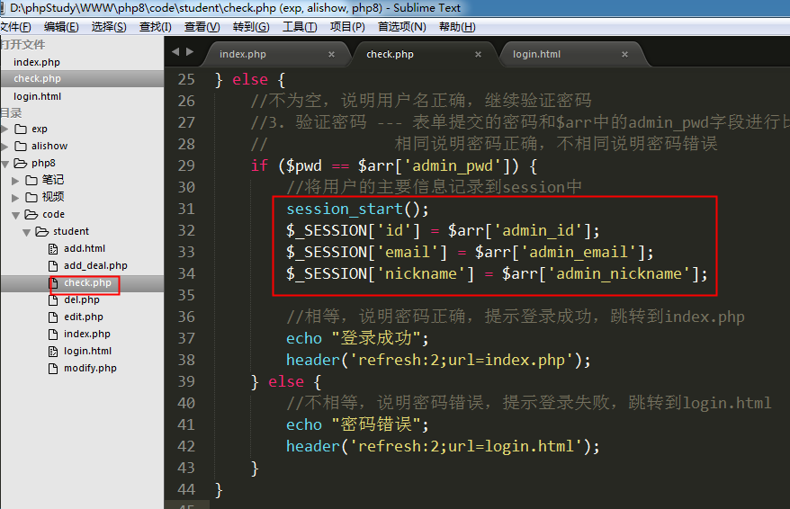

2) 在其他页面中检测session是否存在

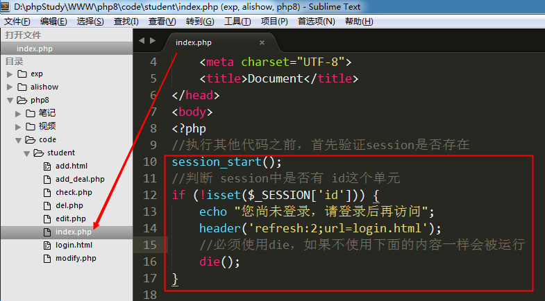

3) 将检测session 的代码复制到每个页面中，除了 login.html 和 check.php

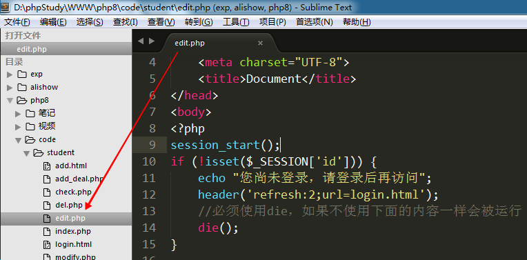

# 2. 会话控制小结

## 2.1 cookie原理

  当浏览器访问一个带cookie的页面时，cookie会随着响应头返回给浏览器。

  当再次访问该网站的页面时，cookie会随着请求头一起发送给服务器。

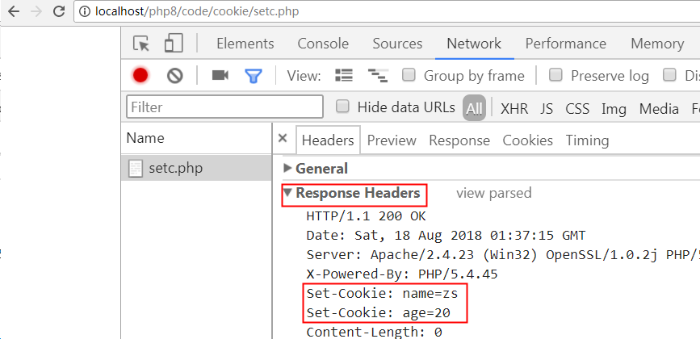

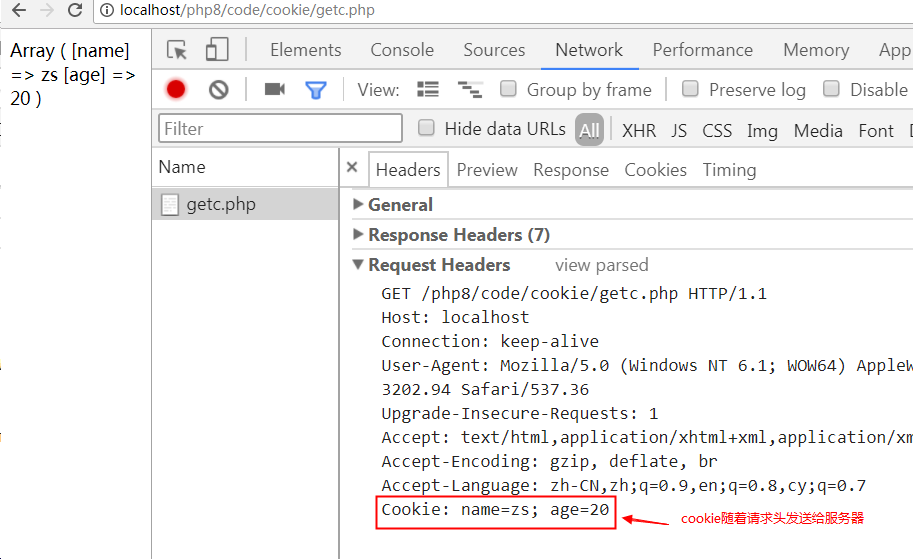

## 2.2 session和cookie的联系

1) session原理

​    session默认是保存在服务器的文件当中的。
    windows默认存放在 c:/windows/temp目录下，==phpstudy存放在 phpstudy/tmp/tmp目录下==

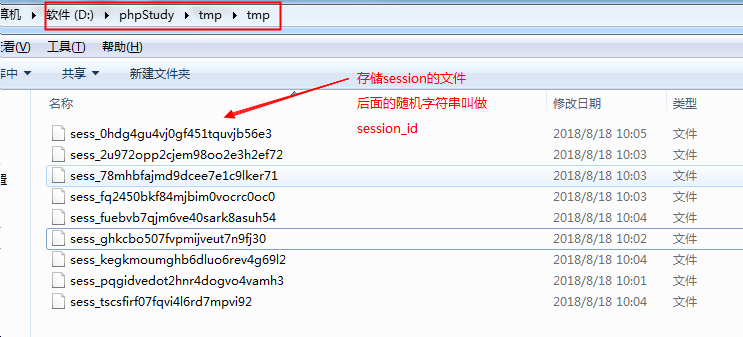

2) cookie和session的联系

​     当浏览器访问一个设置session的页面时，服务器会随机自动生成一个session_id（字符串）。通过响应头的set-cookie返回给浏览器，并保存在浏览器的cookie当中，同时服务器中也会生成一个以该session_id为名称的文件，用来记录信息。

​     浏览器之后每次访问该网站时，都会携带cookie中的session_id，来和服务器中的session文件名进行比对。当文件名和cookie中的session_id一致时，则说明使用的是该session文件，可以从该session文件中读取数据。

案例: 访问 sets.php文件 和  gets.php

sets.php

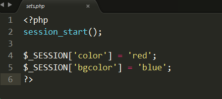

gets.php

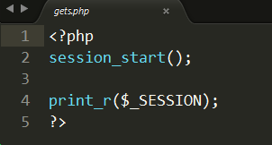

访问 sets.php文件时，完成两件事情

1) 将session_id随着响应头返回给浏览器，并保存在浏览器中

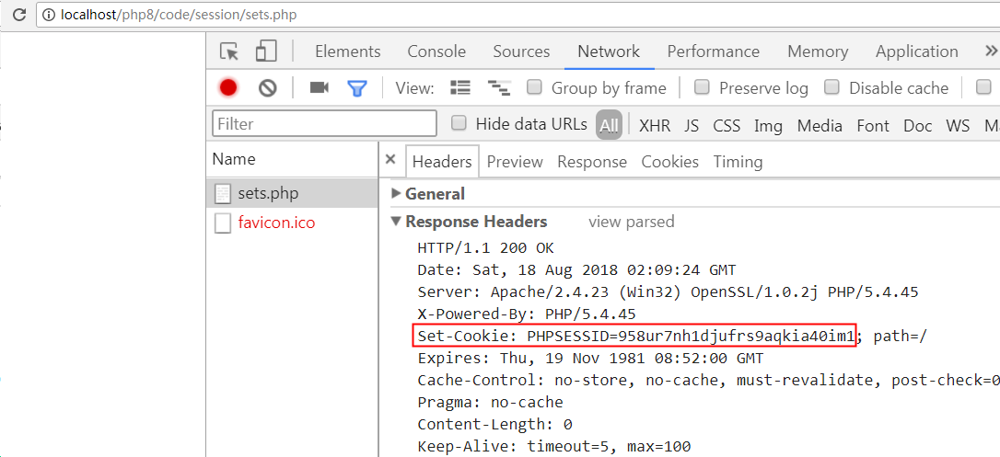

2) 在服务器端创建一个session文件   sess_958ur7nh1djufrs9aqkia40im1， 将$_SESSION中已保存的数据，存储到该文件中。

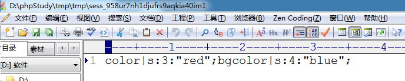

gets.php文件

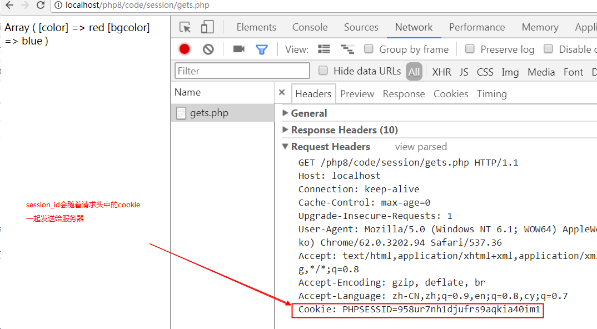

服务器在tmp目录下找到 sess_958ur7nh1djufrs9aqkia40im1 文件，并将文件中的数据取出，返回给浏览器

## 2.3 session和cookie总结

 cookie小结:

  1） 将数据保存在客户端，安全性不好，但是可以保存的数据量较大。

​        一个网站能向一个浏览器写 20 个cookie

​        一个浏览器最多保存300个cookie，每个cookie最大4kb

  2） 设置cookie使用  setcookie(var1, var2, var3)；
	var1： cookie名称
	var2： 名称对应的值
	var3： 有效期。 可选参数，如果不设置该值或者设置为-1，浏览器关闭则cookie消失
  3） 使用$_COOKIE 预定义数组来读取cookie
  4） cookie的有效范围： 当前目录及子目录；上级目录无效
  5） 删除cookie:  setcookie(‘name’, null);

 

 session小结:

  1) 将数据保存在服务器端，安全性高，但是不能保存大量的数据。一般来讲session当中保存的都是用户信息。
  2) 使用session时，首先要使用 session_start函数开启session
  3) 设置和读取session时，都是用`  $_SESSION['name'] = 'zs';  $_SESSION['name'];`
  4) session的有效范围，在一个域名下设置session，在整个域名范围内都有效
  5) 删除session
	unset($_SESSION[‘name’]);    //删除单个session
	session_destroy();                   //删除所有session

