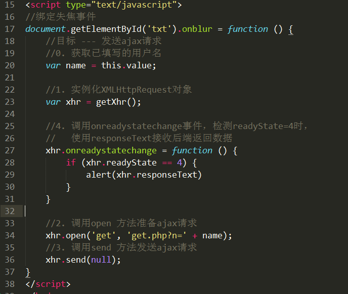
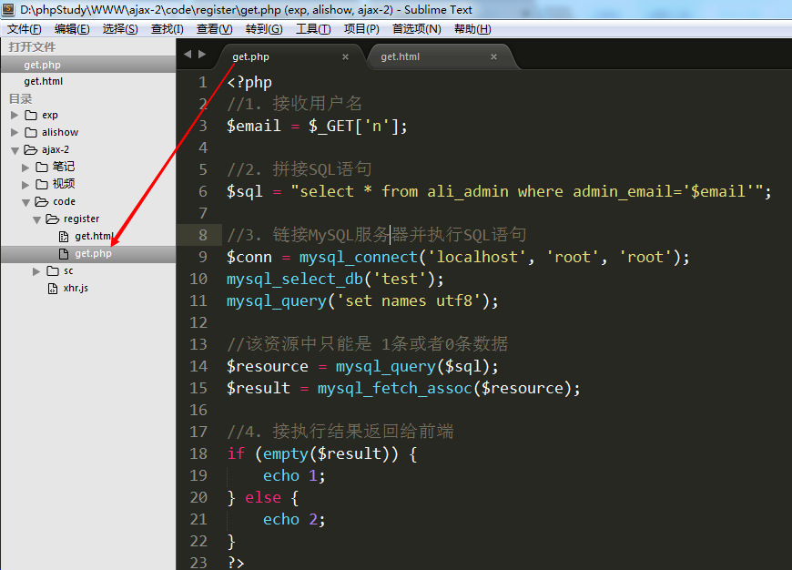
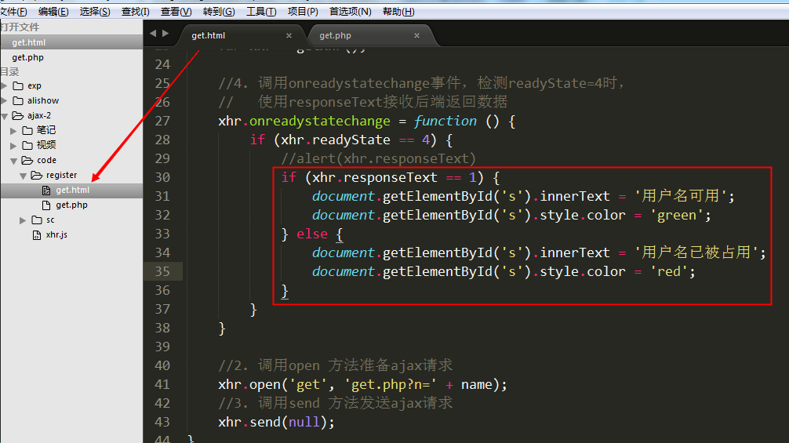
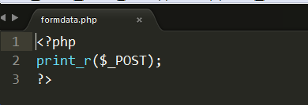
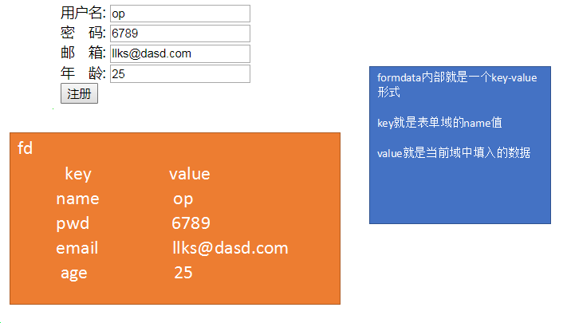
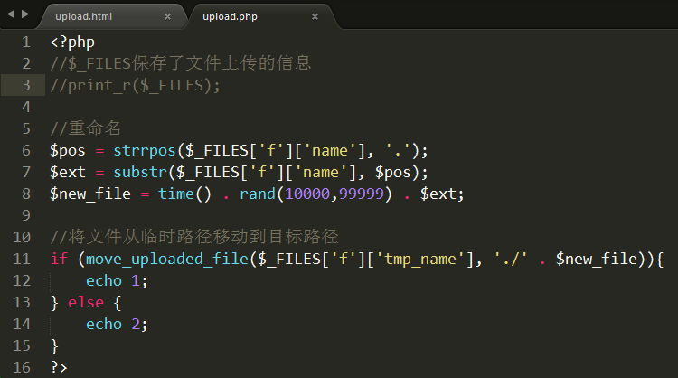
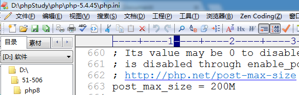

# Ajax技术-2 #
每日目标：

-  掌握post和get的在ajax中的区别
-  理解get缓存并能解决缓存
-  理解同步和异步
-  掌握timeout和ontimeout
-  掌握FormData表单对象的用法
-  能够实现文件上传进度条

# 1. POST和GET的区别

## 1.1 GET方式实现新用户注册---用户名检测

 思路分析:

 步骤:

1. get.html

​       1) 在用户名文本框上绑定失焦事件(onblur)
       2) 失焦事件函数
​            ① 获取用户名文本框内已填写的用户名
​            ② 发送ajax请求，并将已填写的用户名一起发送给后端php页面

2. get.php

​      1) 接收前端发送过来的用户名
      2) 链接MySQL服务器，验证用户名是否被占用
      3) 将结果返回给前端

3. get.html

​      1) 接收后端返回的数据，判断是1还是2。

​      2) 如果等于1，则提示用户名可用；如果等于2，提示用户名被占用

代码实现:

1. get.html

​       1) 在用户名文本框上绑定失焦事件(onblur)
       2) 失焦事件函数
​            ① 获取用户名文本框内已填写的用户名
​            ② 发送ajax请求，并将已填写的用户名一起发送给后端php页面

 先测试一下前后端的连通性:

2. get.php

​     1) 接收前端发送过来的用户名
     2) 模拟用户被占用的情况 
     3) 将结果返回给前端（1用户名可用   2用户名被占用）

3. get.html

​     1) 接收后端返回的数据，判断是1还是2。

​     2) 如果等于1，则提示用户名可用；如果等于2，提示用户名被占用

关键点总结:

1. 用户名文本框绑定失焦事件

2. 发送ajax请求基本属于流程化操作

   1) 实例化XMLHttpRequest对象
   2) 调用open方法准备请求，==get方式发送将数据拼接在url地址之后即可==
     xhr.open('get',  'get.php?==n='+name==);
   3) 调用send方法发送请求，==get方式只需要将 null  作为参数传入即可==
   4) 调用onreadystatechange事件，在readyState=4时使用responseText接收返回值。此步使用alert或者console.log先输出接收的结果即可，**==不要着急将结果显示在网页上==**。

3. 创建后端php程序，接收用户名进行验证

   核心SQL:  select * from ali_admin where admin_email = '$name';

   该SQL语句的执行结果只可能是两种： 0条数据    1条数据(因为admin_email字段唯一)

     0条数据: 说明没有该用户名 （没有被占用）

     1条数据: 说明已存在该用户名 （已被占用）

   根据SQL执行结果返回1或者2，1代表未被占用，2代表已被占用

4. 修改get.html文件，将结果显示在网页上

   获取用来显示结果的span标签，判断接收的结果为1还是2。如果为1，则将用户名可用写入span标签；反之，则将用户名已被占用写入span标签

## 1.2 POST方式实现新用户注册---用户名检测

post和get两种方式的整体思路一致，只是细节上有所差别

 1) 使用open准备请求时，参数1需要设置为post，参数2只需要设置后端程序地址。
 2) 将需要传递到后端的数据拼接成一个独立的字符串，字符串的格式为
            ==var str = ‘key=value&key=value&....’;==    （内部结构跟get传参时的结构一致）
 3) 调用setRequestHeader方法将数据格式转为 application/x-www-form-urlencoded
 4) 将拼接好的数据字符串作为参数传入send方法
 5) 后端的php程序需要使用 $_POST来接收数据

前端的区别:

后端的区别:

关键点总结:
 1) 发送程序时，参数1设置为post，参数2只用设置请求的后端文件路径
​    xhr.open('post', 'post.php');
 2) 将需要传递到后端的数据拼接成一个独立的字符串
​    var str = 'name='+name; 
 3) 调用setRequestHeader方法将数据格式转为 application/x-www-form-urlencoded
​    xhr.setRequestHeader('content-type', 'application/x-www-form-urlencoded');
 4) 发送请求时，要将之前拼接好的字符串作为参数放入send方法中
​    xhr.send(str);

补充说明 --- 实际验证用户名是否存在的方法

核心：  `$sql = "select * from ali_admin where admin_email='$username'";`

该SQL语句要么查询出1条数据，要么查询出0条数据
  1条数据说明: 用户名已被占用
  0条数据说明: 用户名未被占用 -- 用户名可用

# 2. GET缓存

## 2.1 什么是缓存？

   浏览器的请求需要从服务器获得许多 css、img、js 等相关的文件，如果每次请求都把相关的资源文件加载一次，对 带宽、服务器资源、用户等待时间 都有严重的损耗。如果浏览器将css、img、js等文件在第一次请求成功后就保存在本机上，以后的每次请求就在本机获得相关的资源文件，那么就可以明显地加快用户的访问速度，同时可以节省各种资源(带宽、服务器资源、用户等待时间)。

## 2.2 GET缓存测试

 ajax方式，get会有缓存问题。

 案例:
   index.html页面中创建一个按钮，点击该按钮时发送ajax请求，得到后端php程序返回的当前时间戳并显示。

  目标:  点击“获取时间戳”按钮时，触发ajax请求，访问后端的getTime.php文件，得到时间戳并弹出显示

1. index.html --- 发送请求

   

2. index.php --- 输出当前时间戳即可。

 在IE下测试:

 

显示的时间戳永远都是这个，说明是缓存问题。

## 2.3 解决方法

 解决方法有两种:
  1) 前端方案:  在open准备ajax请求时，为请求的地址增加随机后缀。相当于每次请求都是新的地址
  2) 后端方案:  后端程序设置不允许缓存的头信息，php程序固定使用如下3句即可。
    header('cache-controller:no-cache');
    header('Pragam:no-cache');
    header('Expires:-1');

1) 前端方案:

2) 后端解决方案:

​    header('cache-controller:no-cache');
    header('Pragam:no-cache');
    header('Expires:-1');

# 3. 同步和异步

## 3.1 同步/异步概念

  同步: ==顺序执行==  第一步---> 第二步 ---> 第三步 ....

  异步:  甲在完成一系列工作时，自己完成主工作。将一些分支工作交给乙，甲此时一直在完成自己的工作，并等待乙完成的结果。乙完成后将结果返回给甲。

  核心: open方法的参数3

​    参数3是一个布尔值， true异步方式（默认）， false是同步方式

## 3.2 案例

   同时显示图片和弹出框

  访问时: 先弹出123，点击“确定”之后，才显示图片 --- 同步

 1) index.html文件

 2) index.php文件

 

异步执行情况:  先显示图片，1秒后才显示时间戳弹出框

同步执行情况:  等待1秒后显示时间戳弹出框，再点击确定之后才显示图片

重点 :  在实际开发中 95% 以上的请求，都使用异步。

# 4. XMLHttpRequest2.0新特性

## 4.1 timeout 和 ontimeout

  timeout： 请求超时设置。属性，用来设置等待响应时长，如果超过指定时长，则会触发ontimeout事件

​	xhr.timeout = 3000;    // 设置等待时长为3秒

  ontimeout： 事件，用来设置超过等待时长后的动作

​        xhr.ontimeout = function () {

​		alert('请求超时');

​        }

在创建xhr对象之后，来设置timeout属性；如果设置了timeout属性，那么就建议设置ontimeout事件。

## 4.2 FormData表单对象

小案例:  点击button按钮时，将用户名和密码值通过ajax发送到后端php页面

FormData对象优势就是能够一次性将表单中的所有数据全部取出，包括文件域的文件对象。

1)创建表单 --- form标签很重要， method和action不重要
   每个表单域需要设置name值

2)发送ajax请求
①将表单数据取出 --- FormData
i.获取form表单对象:        var fm = document.getElementById(‘mainForm’);  //DOM对象
ii.实例化FormData对象:  var fd = new FormData(fm);

②发送ajax请求
   使用FormData对象以后，必须使用post方式来发送ajax请求。
   将FormData对象，作为参数传入 send方法中  xhr.send(fd);

③ 使用FormData对象提交表单时，不需要设置 setRequestHeader方法

注意点: 

   ① form标签要给id值，方便获取form标签的DOM对象

   ② 每个域都要给 name值

   ③ 提交按钮必须用 button，因为submit有跳转功能

代码实现:

1) 使用FormData对象获取所有表单的数据，并发送ajax请求

2) 在formdata.php页面，接收数据

访问结果:

FormData的内部构造:  key-value

# 5. 文件上传进度条

 1) 完成Ajax文件上传

​    核心: Ajax方式上传文件必须使用FormData对象

​    关键点:  
     ① 表单使用提交按钮，一定是button
     ② 获取文件对象 ---- FormData
          i.根据id获取form表单对象 ---- DOM
          ii. 实例化 FormData对象，将表单对象作为参数传入
	  iii. 因为使用了FormData，所以一定要用post方式发送请求，将fd作为参数传入send方法

 

 upload.html

​    获取文件数据，发送ajax请求

  upload.php 

2) 调整php配置文件（php.ini），使其支持大文件上传

  ① 修改允许上传文件最大的大小

   ② 修改post表单提交数据的最大大小

   重启Apache服务器。

  3) 文件进度条

​     ① 在页面上设置一个div，用来表示进度条

  

​       ②  根据实际上传百分比来绘制进度条的宽度

​        核心:  xhr对象中有一个子对象（upload），upload对象中有一个事件 onprogress。该事件大约每100ms执行一次，里面有两个重要属性  loaded(已上传大小)    total（总大小）