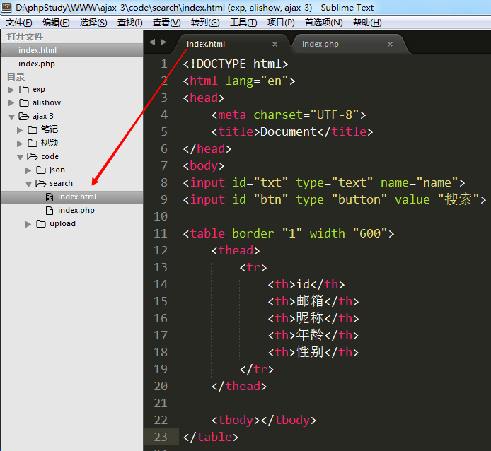
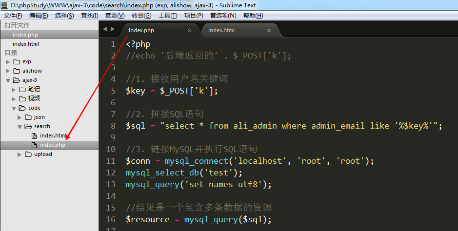
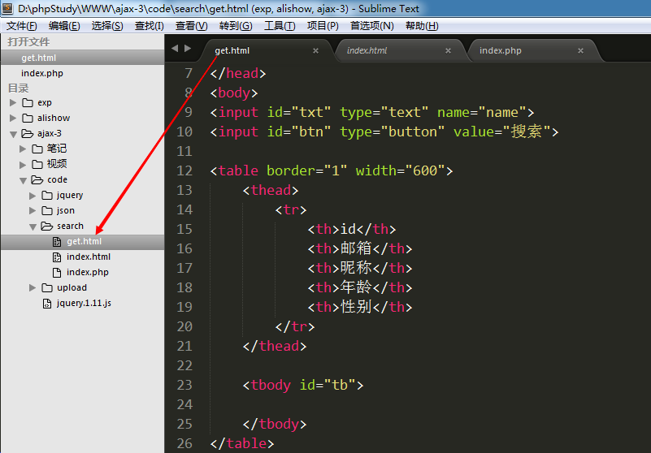
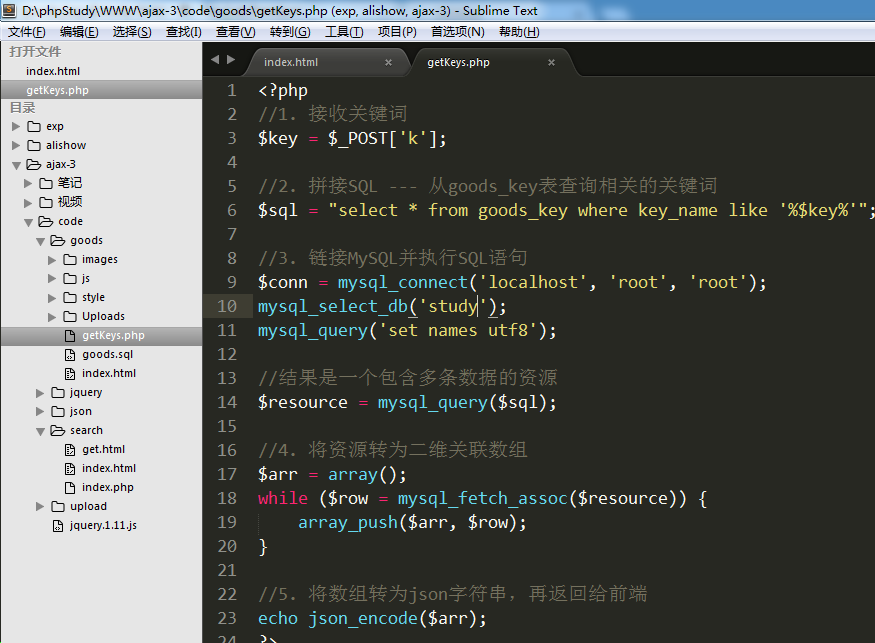
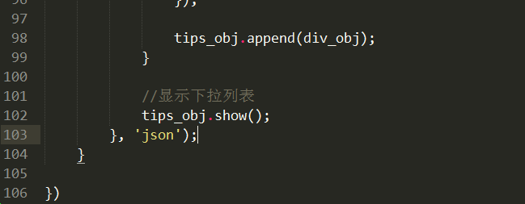

# Ajax技术-3 #

# 1. JSON

## 1.1 什么是JSON？

JSON:  JavaScript Object Notation 是一种轻量级数据交互格式。  


数据交互: 每一种语言的编码都不一样，它们之间互不认识。但是现在的情况是不同的语言开发出的系统也需要进行数据交互，这时候就需要一种大家都认识的语言或者技术来实现。


xml: 扩展标记语言

## 1.2 JSON数据的声明和使用

声明:  var json_obj = {"key1":"value1", "key2":"value2", ...};
key: ==双引号包含的字符串==
value: 数据--数值型、字符串、数组、json对象

```
//key：必须用双引号
var json1 = {"a":"Hello", "b":"world"};
alert(json1.a);

var json2 = {
    "name": "郭德纲",
    "age": 50,
    "tudi": ['岳云鹏', '烧饼', '张云雷'],
    "son": {"name":"郭麒麟", "age":20}
};
alert(json2.name);
alert(json2.tudi[1]);
alert(json2.son.name);

//数组，内部的每个单元都是一个json
var json3 = [
    {"name":"赵四",   "age":50},
    {"name":"小沈阳", "age":46},
    {"name":"刘能",   "age":50},
    {"name":"宋小宝", "age":52},
];
alert(json3[2].name);
```


JSON的本质:  JSON 是 JS 对象的字符串表示法，它使用文本表示一个 JS 对象的信息，本质是一个字符串。
var obj = {a:"hello", b:"world"};       // js对象
var obj = {"a":"hello", "b":"world"};    // ==json格式的js对象==，也可以叫json对象 (JSON才是真正的JSON对象)
var str = '{"a":"hello", "b":"world"}';    // json，也叫json格式的字符串 ==必须外层单引号，内存双引号==

var str = "{'a':'Hello', 'b':'world'}";  //错误，不能这样写，会影响到其他程序的执行


## 1.3 PHP数组转JSON格式的字符串

 php提供了函数：  json_str  json_encode($arr);

案例1: 索引数组转JSON  --->  数组
案例2: 关联数组转 JSON  --->  json对象
案例3: 二维数组转JSON  --->  一维数组，每个单元都是一个json对象


```
//索引数组
$arr = ['zs', 'ls', 'ww'];
// 一个索引数组被json_encode之后仍然是一个数组，
// 但是是一个字符串形式数组
echo json_encode($arr); // '["zs", "ls", "ww"]'

echo "<hr>";

//关联数组
$info = ['id'=>1001, 'name'=>'王小明', 'age'=>8];
// 一维关联数组被json_encode之后是一个json字符串
echo json_encode($info); // '{"id":1001, "name":"王小明", "age":8}'

echo "<hr>";

//二维数组
$list = [
    ['id'=>1001, 'name'=>'王小明', 'age'=>8],
    ['id'=>1002, 'name'=>'韩梅梅', 'age'=>10],
    ['id'=>1003, 'name'=>'李雷', 'age'=>9]
];
// 二维数组，会转为数组，内部的每个单元都是json
echo json_encode($list);
/*
'[
    {"id":1001,"name":"王小明","age":8},
    {"id":1002,"name":"韩梅梅","age":10},
    {"id":1003,"name":"李雷","age":9},
]'
*/
```


执行结果:


## 1.4 JSON字符串转JSON对象 --- javascript代码

前端的ajax请求，最后接收到的都是字符串 --- responseText，以字符串形式接收后端返回的数据

var a = '[{"id":10001,"name":"zs","age":20},{"id":10002,"name":"ls","age":21},{"id":10003,"name":"ww","age":19}]'


json格式的字符串转为json对象:  JSON.parse(json_str); 
参数: json格式的字符串


```
var s = '{"id":1001,"name":"王小明","age":8}';
alert(s.name);

//将json格式字符串转为json
var json = JSON.parse(s);
alert(json.name);


var arr = '[{"id":1001,"name":"\u738b\u5c0f\u660e","age":8},{"id":1002,"name":"\u97e9\u6885\u6885","age":10},{"id":1003,"name":"\u674e\u96f7","age":9}]';
alert(arr[1]);

var arr1 = JSON.parse(arr);
console.log(arr1[1]);
```


## 1.5 案例 --- 搜索用户名，显示用户列表信息

 

思路:
1) 创建一个搜索页面，定义好搜索框，表头。在搜索按钮上绑定点击事件。
2) 点击事件能够发送ajax请求，并将用户名文本框中的内容一起发送到后端php程序
3) 后端php程序接收用户名，链接MySQL进行模糊查询，再将数组返回给前端
4) 前端接收到后端php返回值之后，循环显示出来


代码实现 : 

1) 创建一个搜索页面，定义好搜索框，表头。在搜索按钮上绑定点击事件。

 页面布局:




2) 点击事件能够发送ajax请求，并将用户名文本框中的内容一起发送到后端php程序

在搜索按钮上绑定点击事件 --- 获取文本框中的用户名，发送ajax请求


3) 后端php程序接收用户名，链接MySQL进行模糊查询，再将数组返回给前端

  核心操作: 将资源转为二维数组，再将二维数组转为json字符串，再返回给前端




 


4) 前端接收到后端php返回值之后，循环显示出来


# 2. jQuery提供的Ajax方法 #

 jQuery提供了4个ajax方法:  `$.get()  $.post()  $.ajax()  $.getJSON()`

 前三个常用

##  2.1 $.get ##
 $.get(var1, var2, var3, var4);
  参数1: 请求的后端程序的地址
  参数2: 要发送到后端程序的数据，json对象/js对象（推荐）或者 字符串
  参数3: 当readyState==4时的触发函数，该函数中有一个参数，就是后端程序返回的数据
  参数4: 设置返回数据的类型:  text(默认)  json     xml


案例: 在get.html文件中发送一个ajax请求，去请求后端的get.php页面，同时将id=1数据发送给后端

示例: 

```
$.get('get.php', {"goods_id":10101, "_":Math.random()}, function(msg){
	alert(msg);
}, 'json');
```

​	 

解析:   上面的代码等价于原生js的

```
var xhr = new XMLHttpRequest();
xhr.onreadystatechange = function(){
	if(xhr.readyState == 4){
		msg = xhr.responseText;
		msg = JSON.parse(msg);
		alert(msg);
	}
}
xhr.open('get', 'getData.php?goods_id=10101&_='+Math.random());
xhr.send(null);
```

​     

使用jquery提供的ajax方法，就是为了简化开发。

  

使用 $.get 改造 1.5的搜索案例

1) 表格和文本框一样




2) $.get发送请求


##  2.2 $.post ##
`$.post`函数的用法和`$.get`一模一样，只是发送请求方式变为post

 $.post(var1, var2, var3 , var4);    //最标准的写法
  参数1: 请求的后台程序的地址
  参数2: 要发送到后台程序的数据，json对象/js对象（推荐） 或者 字符串
  参数3: 当readyState=4时的触发函数，该函数中有一个参数，就是后台程序返回的数据
  参数4: 设置返回数据的类型:  text(默认)  json     xml


示例: 

```
$.post('getData.php', {"goods_id":10101}, function(msg){
	alert(msg);
}, 'json');
```

​	 

解析:   上面的代码等价于原生js的

```
var xhr = new XMLHttpRequest();
xhr.onreadystatechange = function(){
	if(xhr.readyState == 4){
		msg = xhr.responseText;
		msg = JSON.parse(msg);
		alert(msg);
	}
}
xhr.open('post', 'getData.php');
var param = 'goods_id=10101';
xhr.setRequestHeader('content-type', 'application/x-www-form-urlencoded');
xhr.send(param);
```


## 2.3 案例 --- 搜索框下拉列表


数据表设计:


key_id: 主键

key_name: 关键词


 思路分析:

1. index.html  ---  在搜索框上绑定keyup事件，获取搜索框内容并发送ajax请求

   1) 在搜索文本框上绑定键盘弹起事件

   2) 事件函数

      ① 获取搜索框内容

      ② 发送ajax请求，等待结果

   

2. getKeys.php ---  接收关键词，并根据关键词从数据表中查出相关的其他关键词，返回给前端

   1) 接收关键词

   2) 编写SQL语句，查询和接收关键词相关的所有关键词

   3) 将查询结果返回给前端

   

3. index.html --- 将接收到关键词循环显示到下拉列表（tips）中

   接收后端返回结果并显示

   1) 制作下拉列表

   2) 将后端返回的每条关键词都填充到下拉列表中

   3) 完善下拉列表

      ① 每次循环取出关键词时都先创建div，并将关键词放在div中

      ② 为div绑定鼠标悬浮事件（高亮显示）和鼠标移出事件（取消高亮显示）

      ③ 为div绑定点击事件，将选中的关键词放入搜索框

      ④ 将每个div都放入tips

      ⑤ 将tips显示出来

      ⑥ 每次向tips中填充数据时，都要先清空tips

   ​


代码实现:

index.html  ---  在搜索框上绑定keyup事件，获取搜索框内容并发送ajax请求

1) 在搜索文本框上绑定键盘弹起事件

2) 事件函数

   ① 获取搜索框内容

   ② 发送ajax请求，等待结果


getKeys.php ---  接收关键词，并根据关键词从数据表中查出相关的其他关键词，返回给前端

1) 接收关键词

2) 编写SQL语句，查询和接收关键词相关的所有关键词

3) 将查询结果返回给前端




下拉列表


index.html 将结果显示到下拉菜单中





关键点总结:

1) 使用键盘弹起事件来触发ajax请求

   ① 获取搜索框中的内容

   ② 发送ajax请求，并将搜索框中的内容一起发送给后端

2) 接收到的数据需要循环显示在下拉菜单中

   ① 将返回的字符串转为数组（内部是json对象）

   ② 循环数组，取出每一个相似关键词

   ③ 在循环中创建div对象，将关键词加入div对象

   ④ 在div上绑定鼠标悬浮事件，修改背景和字体颜色

   ⑤ 在div上绑定鼠标移出事件，修改背景和字体颜色为初始颜色

   ⑥ 在div上绑定点击事件，将内容写在搜索框中，并隐藏下拉列表

   ⑦ 将div追加到下拉列表中，然后再将下拉列表显示出来

   ⑧  在循环显示下拉列表之前先清空下拉列表中已有内容


