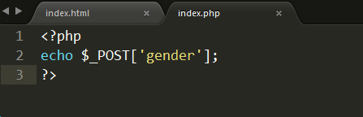
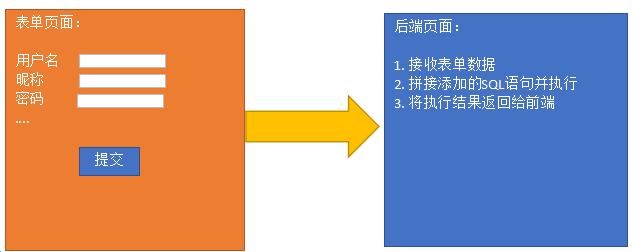
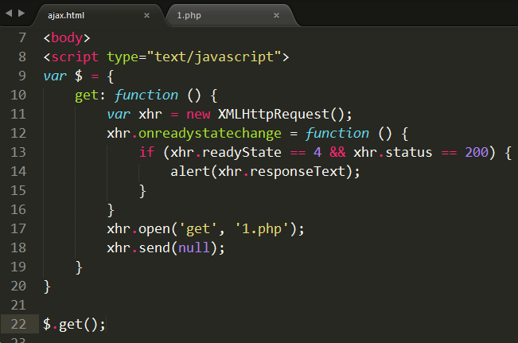
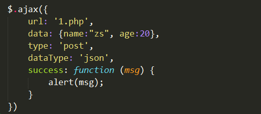
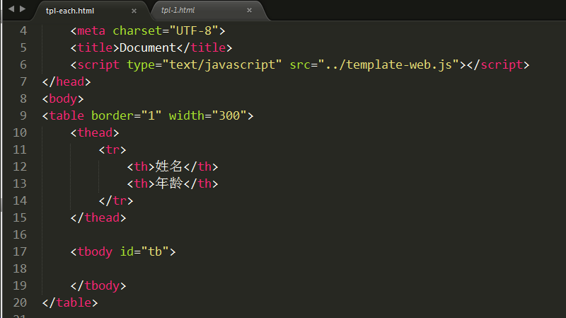
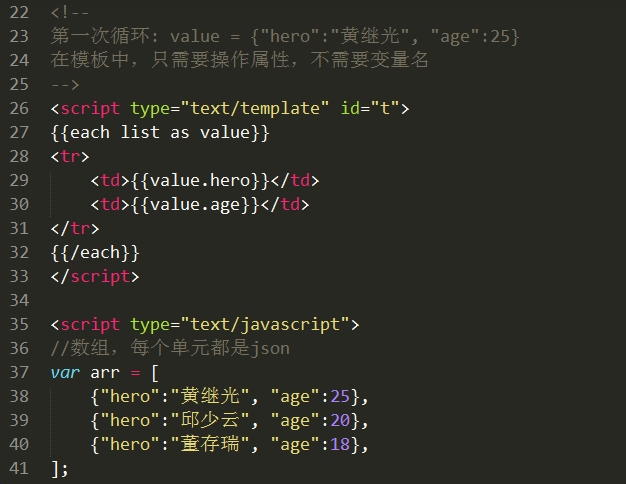

# Ajax技术-4

# 1. jQuery的Ajax方法 #

##   1.1 $.ajax方法 ##

 `$.ajax`使用JS对象来配置ajax请求  ---  $.ajax(obj);

 必须配置项：
  url:         要请求的后台程序地址
  data:      要发送到后台程序的数据 (建议使用json/js对象格式，也可以使用字符串，也可以是FormData)
  type:      请求类型  post和get 两种  (put、delete)
  dataType:  返回值类型  text(默认) 、 json 、xml 、 jsonp(跨域使用) 
  success:   成功完成ajax触发的事件，回调函数，其参数是后端程序的返回数据

简单案例:

 1) 发送ajax请求

 2) 后端返回数据

其他配置项：

  cache: 是否进行缓存(true/fasle)，如果设置type为get，一般设置该项为false(不缓存)。
  async: 同步/异步设置，true(异步、默认) false(同步)。
  timeout: 超时设置，多少ms之后扔未接收到后端返回数据，则结束本次请求。--- 进入error方法中
  error: 请求失败时的回调函数，该函数有三个参数。参数1是xhr对象，参数2是错误信息（错误信息通常是 "null", "timeout", "error", "not modified" 和 "parsererror"），参数3是异常对象（可选）。
  complete: Ajax完成时的回调函数。不论请求成功还是失败都会执行该方法
  beforeSend: 发送Ajax之前执行的回调函数。

  beforeSend()  --->  success/error()  ---> complete()

  contentType:  头信息设置，使用FormData对象时设置该值为false，其他情况会自动设置，不需要手动设置。
  processData:  处理数据方式，使用FormData对象时设置该值为false，其他情况会自动设置，不需要手动设置。

  注意: ==contentType和processData只有在使用FormData对象时，设置为false，其余情况均不用设置==

## 1.2 案例 ---  添加新管理员 ##

 

  如果发送的数据是FormData，那么就只能使用原生js 或者 $.ajax

  $.ajax发送请求时，如果发送的数据是FormData时，必须设置 contentType和processData为false

  1) 表单页(index.html)

​       提交按钮上，绑定点击事件，获取表单数据，发送ajax请求

  2) php页面接收表单数据，拼接SQL语句并执行 

  3) 前端接收结果，进行提示

代码实现:

1) 表单页(index.html)

​    提交按钮上，绑定点击事件，获取表单数据，发送ajax请求

​     因为用到FormData来获取表单数据，所以必须用$.ajax，发送请求时要额外配置contentType和processData

2) php页面接收表单数据，拼接SQL语句并执行  （自己完成）

3) 前端接收结果，进行提示（自己完成）

# 2. 自己封装Ajax --- 和jQuery一样 #

从一般到通用。
从一个具体的案例，完善成一个兼容相同功能函数
  1) 编写一个具体案例
  2) 分析其中的缺陷
  3) 完善缺陷

## 2.1 封装 $.get方法

1) 编写一个具体的案例
   具体案例:  封装一个get方法，能够发送ajax请求，请求1.php文件，并且能接收到1.php的返回数据

  ① 使用原生js完成整个ajax请求过程

  ② 定义$对象，再定义get成员方法

==分析具体案例存在的问题，一步一步将存在问题修正，就能够形成一个通用的函数了。==

具体案例存在的问题:
① 在创建XMLHttpRequest对象时，没有处理浏览器兼容性
② 只能访问1.php程序
③ 无法灵活向后台的1.php程序发送参数
④ 前端无法灵活接收后端返回的数据
⑤ 返回值类型单一，只能使用字符串

2) 处理创建XMLHttpRequest对象时的兼容性问题

3) 处理只能访问1.php文件的文件的问题。
  思路: 定义get函数时设置形参，调用函数时传递实参

① 修改get方法，设置参数1 --- 请求的url地址

② $调用get方法时，需要传递实参

4) 处理请求后台文件时无法发送数据 
  思路: 将js对象组装为字符串，拼接在请求的url地址之后

 $.get('1.php', {"id":1, "name":"zs"} , ....)  --> 1.php?id=1&name=zs

 本质: {"id":1, "name":"zs"} ---> id=1&name=zs

 

① 封装params方法，将js对象转为字符串

 i. 创建了一个test.html页面，用来测试js对象转字符串的方法

 ii. 将封装好的函数加入到 $ 对象中

② 在get方法中定义参数2， 并在get方法中调用params方法，将参数2的js对象转为字符串，将字符串参数拼接到url地址当中

 

5) 处理readyState==4时的回调函数

① 在$.get方法中设置参数3，在方法体中使用函数形式调用，就相当于执行了一个函数

② 在调用$.get方法时，以回调函数形式传入参数3

6) 处理能够接收不同类型的返回值

① 在$.get方法声明时，设置参数4，判断参数4的值，如果是json则进行额外处理

② 在调用$.get方法时，传入参数4

## 2.2 封装 $.post方法 ##
 1) 创建post方法，能够发送ajax请求
 2) 处理向后台发送的数据
 3) 处理回调函数和返回值类型

1) 封装普通的方法

2) 处理xhr的浏览器兼容性问题

3) 请求地址参数问题

4) 让请求能够发送数据

5) 回调函数

6) 设置返回值类型

## 2.3 封装 $.ajax方法 ##
 核心思想:
1) 将发送请求的地址、方式、数据、返回值类型、回调函数都封装到js对象中，然后作为参数传入$.ajax方法中。
2) 在$.ajax方法中区分post和get方式，分别调用get方法和post方法。

# 3.模板引擎

## 3.1 为什么要使用模板引擎

通过搜索用户名案例我们发现，要渲染到网页上的数据是使用js循环拼接字符串，再将拼接好的字符串填入tbody标签中的。

   这种方式可读性差，出错不容易查找。

   模板引擎技术就是为了解决字符串拼接问题的。 ==模板引擎技术本质就是拼接字符串。==

   传统模式有两种拼接显示字符串的方式:

- 在后端程序中拼接好，然后以字符串形式返回
- 后端程序返回json字符串，前端程序接收了之后，解析json进行拼接

模板引擎方式：
    模板引擎属于前端程序拼接字符串
    提前定义好要显示格式，所有数据位置以特殊标记表示出来。模板引擎会自动分析，并将数据填写到对应的位置。

我叫__ , 今年__ 岁了

## 3.2 常见模板引擎

ArtTemplate：https://github.com/aui/artTemplate
velocity.js：https://github.com/shepherdwind/velocity.js
Handlebars：http://handlebarsjs.com

## 3.3 artTemplate快速上手

基本使用步骤:
  1) 使用script标签引入arttemplate库文件 (template-web.js)
  2) 定义标签，用来显示最终解析好的模板信息
  3) 定义模板和模板中所需数据。
      ① 定义要显示在模板中的数据，必须是 json 对象
      ② 使用script标签定义模板，type="text/template"  id="tpl"，并且使用 {{}}  将所有数据位置标记出来
  4) 调用template函数，解析模板
  5) 将解析好的模板字符串填充到事先定义好的标签中(显示到网页上)

简单案例：拼接模板字符串 “我叫张三，今年20岁”，并输出在网页的div中

模板:   我叫__ , 今年__ 岁了

var json = {"name":"zs", "age":20};

① 引入 template-web.js库文件

② 定义标签，用来显示最终解析好的模板信息

③ 定义数据和模板

④ 调用template函数将数据和模板揉到一起

⑤ 将解析好的字符串写入定义好的标签中

关键点：

1) 在定义模板时使用 script 标签， type=“text/==template==”  id="tpl"
2) 定义json对象，json对象中的key一定要和模板中的 {{key}}一致
3) 调用template函数进行解析
    参数1: 模板的id值
    参数2: json对象
    返回值:解析好的字符串

## 3.4 循环结构 --- each

  关键点: 
1) template函数需要的参数是一个json对象，所以需要声明json对象，里面是数组

2) 在定义模板时使用each进行循环

  each结构:   

  {{each data as value}}

​	输出内容

  {{/each}}

  data: 要循环的数组

  value: 循环取出的单元值

  注意: 使用 {{/each}} 结束循环

① 使用script标签引入arttemplate库文件 (template-web.js)

② 定义标签，显示最终结果的标签

③ 定义数据和模板

④ 调用template函数，将数组和模板进行解析

⑤ 将解析好的字符串显示到div中

var  arr= [

​	{"name":"zs", "age":20},

​	{"name":"ls", "age":20},

​	{"name":"ww", "age":20},

]

var arr = [

​	{"sno":1, "sname":"aaa", "sage":20, "sgender":"nv", "semail":"dasdsad@d.acom", "stel":"12134333"},

​	{"sno":2, "sname":"aaa", "sage":20, "sgender":"nv", "semail":"dasdsad@d.acom", "stel":"12134333"},

​	{"sno":3, "sname":"aaa", "sage":20, "sgender":"nv", "semail":"dasdsad@d.acom", "stel":"12134333"},

]

## 3.5 选择结构 --- if else

  关键点: 定义模板时使用 

  {{if  判断条件}}

​	程序块1

  {{else}}

​	程序块2

  {{/if}}

## 3.6 使用模板引擎改造搜索用户案例

 目标: 使用模板引擎来代替原来的字符串拼接

① 引入库文件

② 定义标签，显示最终结果的标签

③ 定义数据和模板

④ 调用template函数

⑤ 将解析好的字符串渲染到tbody中

