# Ajax技术-5

模板引擎使用步骤:

 1) 引入template-web.js库文件

 2) 设置一个标签，用来显示最终解析好的字符串

 3) 设置数据和模板

​     数据: 必须使用json，如果不是需要转换或者包装等操作。

​     模板: 使用 script标签，type="text/template"， id="t"

  4) 调用template函数将数据和模板组装到一起

  5) 将解析好的字符串显示到 第二步定义的标签中

  


# 1. 模板引擎

## 1.1 选择结构 --- if else

  关键点: 定义模板时使用 

  {{if  判断条件}}

​	程序块1

  {{else}}

​	程序块2

  {{/if}}


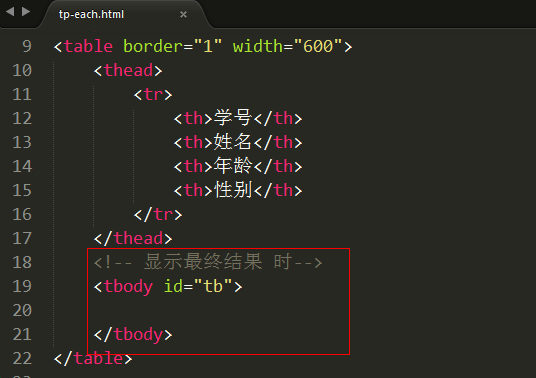


定义数据和模板


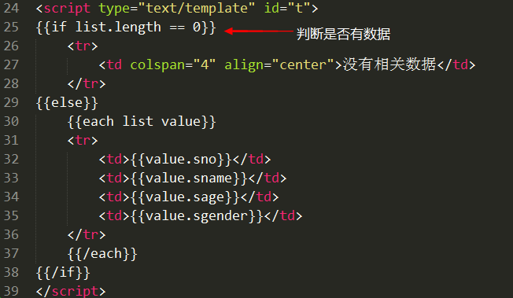


## 1.2 使用模板引擎改造搜索用户案例

目标: 使用模板引擎来代替原来的字符串拼接


① 引入库文件

② 定义标签，显示最终结果的标签

③ 定义数据和模板

④ 调用template函数

⑤ 将解析好的字符串渲染到tbody中


1) 发送ajax请求

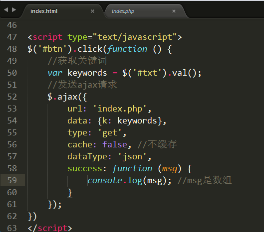


2) 后端php接收关键词，查询，再将结果返回给前端


3) 前端显示数据 --- 模板引擎

   ① 引入 template-web.js 文件

   ② 定义显示最终结果的标签 -- tbody

   ③ 定义数据和模板

​       数据后端返回的 ---  数组，内部是json

​       需要包装成json

​       定义模板： each循环json中的数组，还可以增加if判断

​    ④ 调用template函数组装数据和模板

​    ⑤ 将结果显示到 tbody中

  

定义模板:


定义数据：

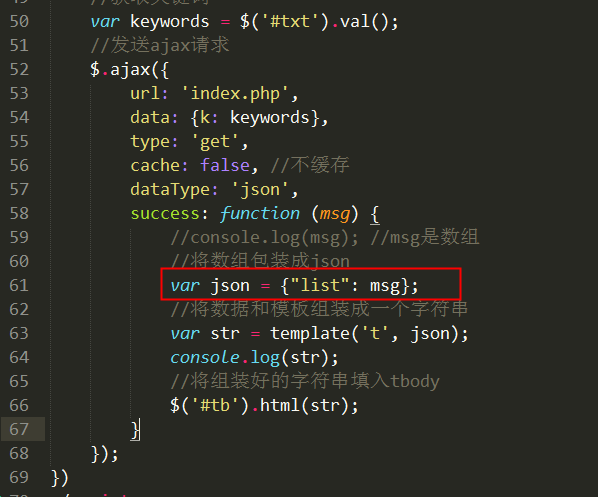


## 1.3 模板引擎原理简介(了解)

 核心原理: 使用正则替换模板引擎中的标记
 例如: 我叫{{name}}，今年{{age}}岁
  使用正则表达式找到模板字符串中的{{name}}和{{age}},再用真实的数据进行替换。

 核心方法:  
  ① reg.exec(str);
  reg: 正则表达式
  str:  字符串
  函数作用: 从str字符串中找到复合reg正则表达式的对象，如果没有则返回null

  ② str.replace(str1, str2);
  函数作用: 在str字符串中找到str1字符串，然后用str2字符串进行替换
  例如:
  str = “abcdefg”;
  str1 = “bc”;
  str2 = “zs”;
  console.log(str.replace(str1, str2)); //  azsdefg

  掌控每一步中变量的内容。


# 2. 虚拟主机配置 #
## 2.1 什么是虚拟主机 ##
虚拟主机，也叫“网站空间”，就是把一台运行在互联网上的物理服务器划分成多个“虚拟”服务器，每一个虚拟服务器都能独立运行一个网站

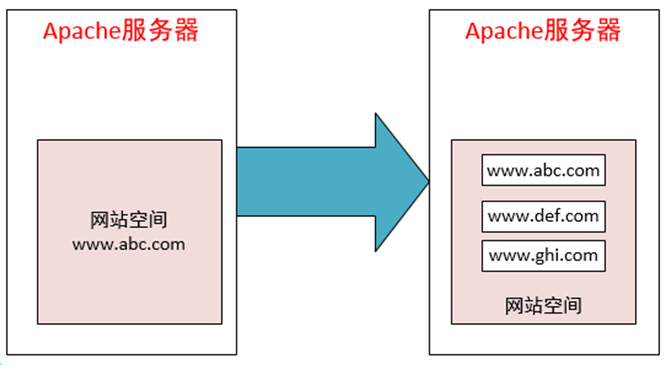


## 2.2 虚拟主机配置3步骤

目标: 将我们的apache做成虚拟主机，同时支持多个网站。  还可以为每个虚拟主机自定义域名

www.study.com


案例: 配置 www.study.com  虚拟主机

1) 修改apache配置文件(httpd.conf)，引入apache的虚拟主机配置文件(httpd-vhost.conf)
     去掉该句前的 # 号


2) 修改虚拟主机配置文件
d:\phpstudy\Apache\conf\extra\httpd-vhosts.conf


3) 修改hosts文件 (使用管理员权限修改)
c:/windows/system32/drivers/etc/hosts


在浏览器中输入 www.study.com 就会访问本机的apache服务器


​                                                      

==重启Apche服务器==


注意：  www.study.com 指向  d:/phpstudy/WWW/study 目录

 配置两个域名：  www.study.com   www.demo.com


# 3. ajax跨域 #
##  3.1 什么是ajax跨域 ##
简单来说，就是网站A去调用网站B的数据。
常见案例： hao123.com的天气预报。


但是Ajax跨域存在一个问题 --- 浏览器的同源策略，该策略会阻止ajax跨域访问
同源策略（Same origin policy）是一种约定，它是浏览器的一种安全功能。 
同源:  同协议，同域名，同端口；   不同源则为跨域


同源限制案例:
www.study.com/origin/index.html使用ajax，请求www.demo.com/1.php文件中的数据

1) 创建 www.study.com/origin/index.html 文件

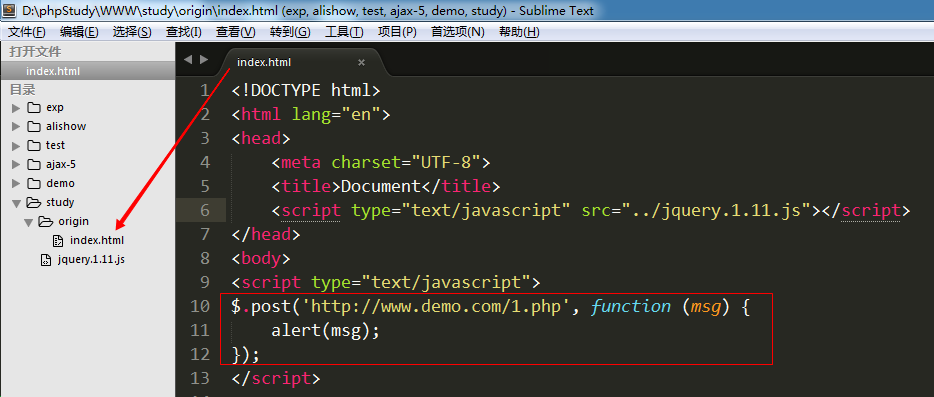


2) 创建 www.demo.com/1.php

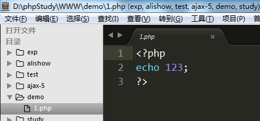


访问结果:

 响应主体: 


  终端：


 看到 Access-Control-Allow-Origin 错误，就说明正在执行跨域请求，请求数据被浏览器的同源策略所阻止。

 


解决跨域问题有三种方式：

- 服务器代理
- cors （跨域资源共享）
- jsonp


##  3.2 代理实现ajax跨域 ##
  核心思想:  php中有一个函数  ==file_get_contents==。 该函数能够获取到其他网站的数据。

  file_get_contents('http://www.baidu.com/index.html');


案例: 
www.study.com/proxy/index.html发送ajax请求，请求www.study.com/proxy/proxy.php文件
proxy.php文件使用file_get_contents函数读取www.demo.com/1.php文件中的内容，再返回给index.html文件中的ajax请求

1)创建  www.study.com/proxy/index.html

​     在该文件中发送ajax请求，请求同服务器(www.study.com)下的 proxy.php文件

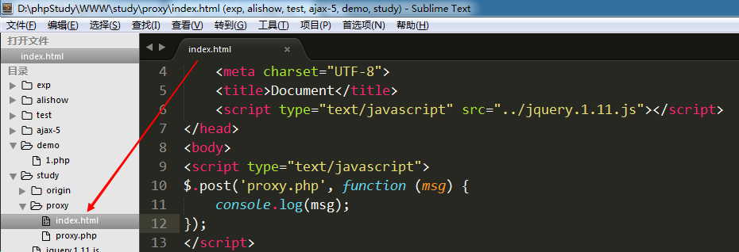


2)创建  www.study.com/proxy/proxy.php 

​    在该文件中使用 file_get_contents函数，读取远程服务器(www.demo.com)1.php中的内容

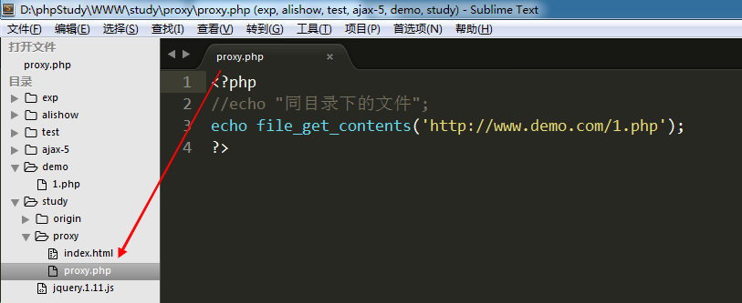


3)创建  www.demo.com/1.php

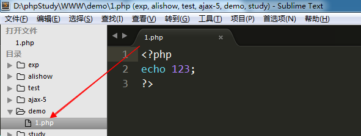


访问结果:


##  3.3 cors跨域 ##
  cors: 跨域资源共享。
  同源策略是浏览器的策略。但是如果服务器允许其他网站的页面进行跨域访问，那么浏览器就不会对返回的数据进行限制了。

  ==核心方法: 在服务器端(PHP文件中)声明不用进行同源限制==

如果设置为 * 则是所有外部网站都可以获取数据
header('Access-Control-Allow-origin: *'); 

只允许www.study.com网站访问并获取数据
header('Access-Control-Allow-origin: http://www.study.com'); 

案例:
www.study.com/cors/index.html通过cors方式，访问www.demo.com/cors.php文件的数据	
1)创建 www.study.com/cors/index.html文件 发送ajax请求


2)创建 www.demo.com/cors.php


##  3.4 jsonp跨域 ##
JSONP(JSON with Padding) : 是一种解决ajax跨域访问的方案。

核心思想:
   浏览器虽然有同源策略，但是 src 和 href 两个属性却可以跨域访问。 可以利用这一“漏洞”发送ajax请求。

案例: 
www.study.com/jsonp/index.html文件中通过script标签的src属性，跨域访问www.demo.com/jsonp.php文件中的数据

1) 创建 www.study.com/json/index.html ,使用 script标签引入了  www.demo.com/jsonp.php文件


2) 创建 www.demo.com/jsonp.php文件 输出个 123

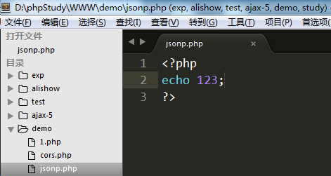


访问结果 --- 响应主体，拿到后端的返回值


3) 调整后台返回数据的方式 --- 返回了一个 ==函数字符串 例如: 'aaa(123)'== 

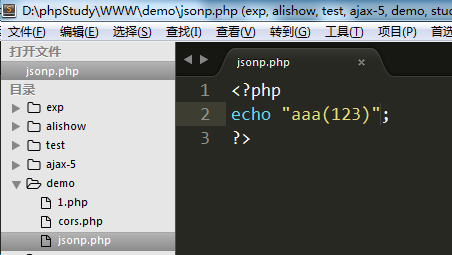


访问结果: 

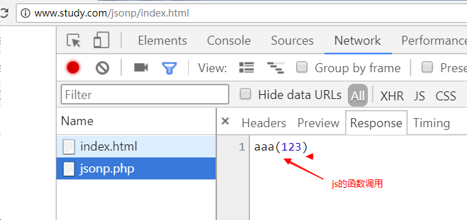


4) 在前端页面提前定义好 函数 aaa()


访问结果 --- 123被输出到终端

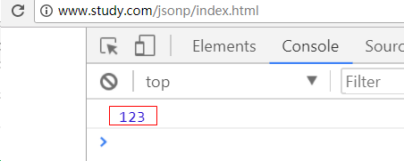


5) 丰富一下后台返回数据的类型

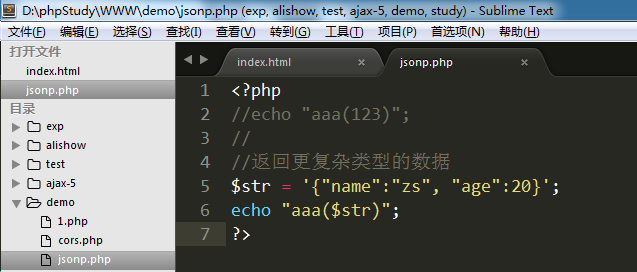


访问结果:

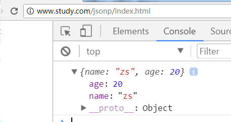


##  3.5 $.ajax方法跨域操作 --- jsonp方式 ##

`$.post $.get $.ajax都能发送跨域请求。但是，$.post和$.get是要依靠cors方式的，只有$.ajax能使用jsonp方式`


核心: 
    必须设置请求类型为get ---  type: ‘get’
    必须设置dataType为jsonp --- dataType: ‘jsonp’
    必须额外设置一个jsonp参数，该参数值可以是任何英文字符串，常用callback。 jsonp: 'callback'
           ==该参数会产生一个随机字符串==
           ==前端使用该字符串创建一个函数==
           ==后端接收该字符串作为返回函数的名称==

示例:

1) 使用jsonp发送跨域请求

```
$.ajax({
    url: 'http://www.study.com/test/3.php',
    type: 'get',   
    dataType: 'jsonp',   
    jsonp: 'callback',  //解决前后端函数名统一的问题   
    success: function(msg){
        alert(msg);
        alert(msg.name);
    }
})
```


2) 后端拼接函数字符串

```
<?php 
// 函数名
$callback = $_GET['callback'];
$str = "$.ajax--->jsonp";
echo $callback . "('$str')";
?>
```

案例:
www.study.com/ajax_jsonp.html 跨域访问www.demo.com/ajax_jsonp.php文件中的内容

1)　创建 www.study.com/ajax_jsonp.html 发送ajax请求

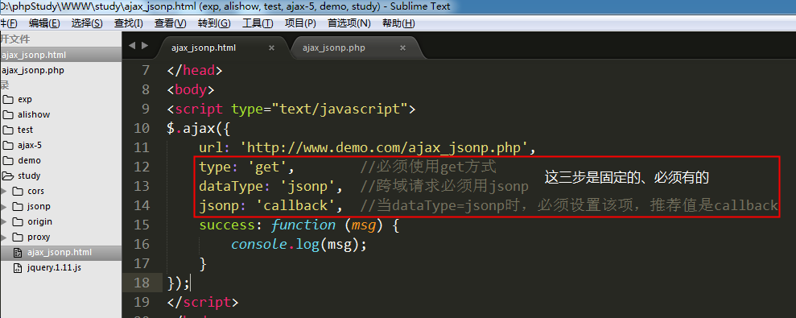


2)　创建www.demo.com/ajax_jsonp.php 返回数据


## 3.6 调用网上接口 --- 天气预报

  网站： www.jisuapi.com


api说明:

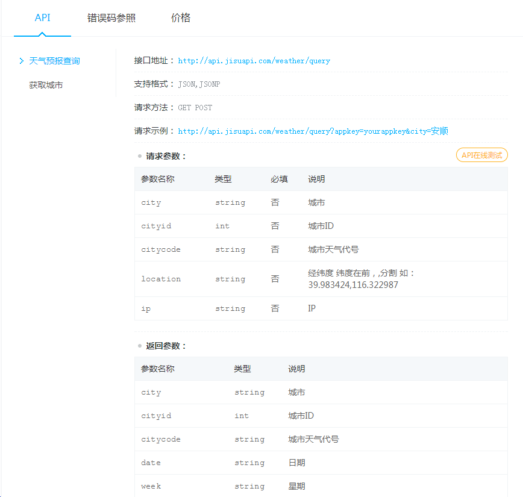


注册，购买后可在“我的api”中看到


1） 发送ajax请求


2) 将取得数据筛选后显示到网页上


