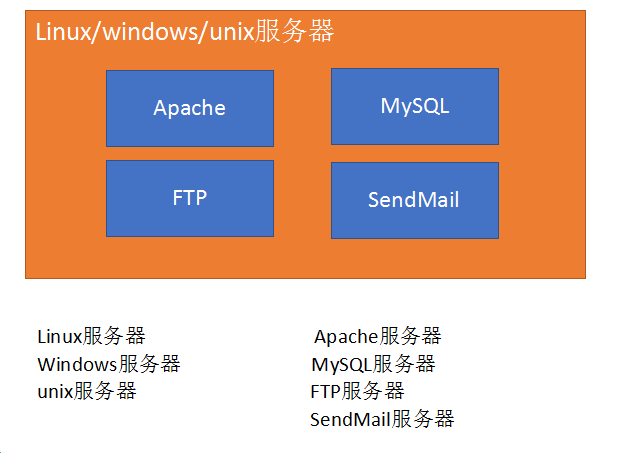
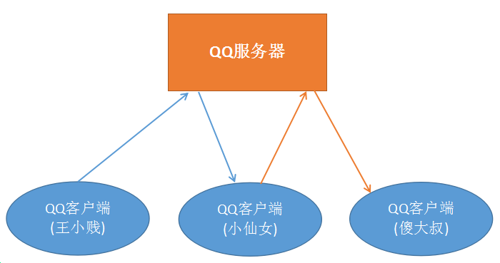
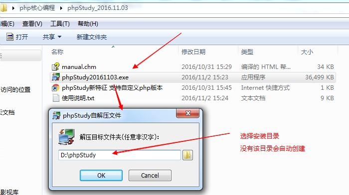
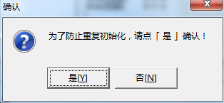
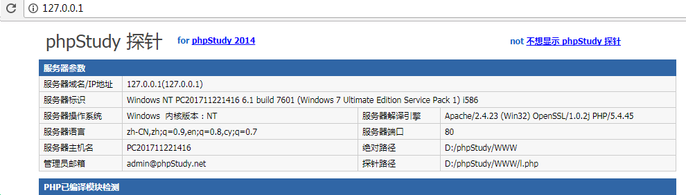
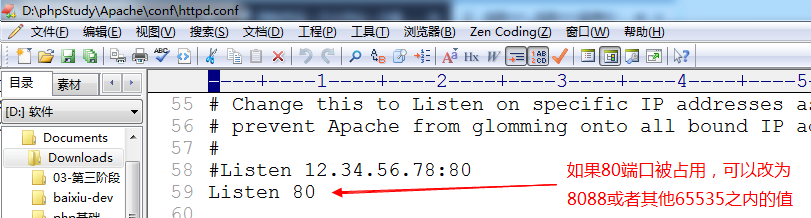
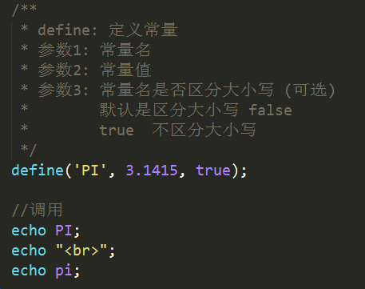
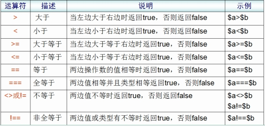

# PHP核心编程-day1 #
# 前言: 

  ==学前端为什么要学php?==

- 从个人来讲： 

​       ==了解后端开发流程之后，有利于项目沟通==

​       懂的越多，薪资越高

-    从公司来讲：

​       公司老板也希望你能够承担更多工作，一个人当两个人用

​    PHP是现在非常流行的一种后端开发语言，常见的语言还有：JSP、ASP.NET、 Ruby等。相对于其他的语言来讲，PHP更容易上手，并且开发速度快、功能强大。


每日目标:

- 说出什么是服务器，什么是web服务器

- 说出PHP的作用

- 能够独立安装phpstudy

- 能够说出IP、DNS、端口是什么

- 理解PHP的运行原理

- 掌握PHP基本语法规则


# 1. web服务器 #
   问题: 当我们写好一个html文件，放在桌面上时，别人能不能通过浏览器访问？
   答: 不行。 必须将我们的html文件放入==web服务器==，其他人通过网络才能访问。
##   1.1 什么是服务器？ ##
   服务器可以从硬件、软件(系统软件、应用软件)两个角度描述。

   按硬件描述： 服务器就是一台超级计算机。
   按系统划分： 在硬件上安装了什么操作系统，就可以称为该系统的服务器
	                   例如:  linux服务器、windows服务器、unix服务器等。
   按软件划分： 在操作系统中安装了什么软件，就可以称作该软件的服务器
	                   例如:  ==web服务器、数据库服务器==、邮件服务器等。


##   1.2 Web服务器 ##
  Web服务器就是安装了Web服务软件，能够提供网站服务的服务器。淘宝、京东、新浪等等

  常见的Web软件：
    ==Apache==、Nginx、IIS、Tomcat、Node等。
    Apache服务器、Nginx服务器、IIS服务器、Tomcat服务器、Node服务器

​    Apache是世界使用排名第一的Web服务器软件。我们将编写好的html、css、js等文件存入apache，就能够通过网络来访问这些文件了。

​    PS: web服务器又叫做http/httpd服务器





# 2. PHP概述 #
##    2.1 PHP简介 ##
​        PHP（外文名:PHP: Hypertext Preprocessor，中文名：“超文本预处理器”）是一种通用开源脚本语言。主要适用于==Web领域的开发==，能够完成==动态网页==的制作。


例如：淘宝的搜索功能，不同的关键词能够动态产生不同的网页。


##    2.2 PHP特点 ##

- PHP是目前最流行的网站开发语言（B/S结构）之一。

- PHP是一种在服务器端执行的嵌入HTML文档的脚本语言。

- PHP 独特的语法混合了 C、Java、Perl 以及 PHP 自创新的语法。

- PHP是一种解释型弱类型语言 （弱类型  解释执行 / 强类型  编译执行）

- 支持几乎所有流行的==数据库==以及操作系统。

- 源码开放、免费（free）  zend


##    2.3 B/S结构和C/S结构 ##
  C/S软件体系结构，即Client/Server (客户机/服务器)结构。
     核心特点：==要下载一个客户端==，例如：QQ、微信、LOL、王者荣耀、绝地求生等。   

  C/S结构的软件，服务器主要做==数据转发==工作。以QQ聊天为例：
     任何两个人聊天的内容都会发送到QQ服务器上，然后再由QQ服务器进行转发

​     王小贱和小仙女聊天
        唐小贱发送一句话，这句话会先发送到QQ服务器，再由QQ服务器转发到小仙女的客户端。




   B/S软件体系结构，即Browser/Server （浏览器/服务器）结构。
       核心特点：==使用浏览器（Chrome、Firefox等）进行操作==，例如：淘宝、京东、新浪等。

   B/S结构软件，服务器承担了所有业务，浏览器只是用来显示最终内容的。

  


思考问题： B/S的优势和劣势， C/S的优势和劣势。

 B/S的优势: 部署方便，容易维护。用户使用方便（一个浏览器即可）。
 B/S的劣势: 客户端功能简单

 C/S的优势: 功能强大
 C/S的劣势: 必须下载客户端非常麻烦，升级维护麻烦
# 3. 安装环境 （phpstudy） #

   phpstudy是一个集成环境，集成了Apache（IIS和nginx）、PHP、MySQL。 安装该软件后，PHP开发的程序就能运行了。

##   3.1 准备工作 ##
   解压phpstudy包


   解压后:


##   3.2 安装 ##

   双击安装文件即开始安装

   特别注意: **==phpstudy的安装路径中不允许出现中文==**，今后安装所有开发相关的软件时也都安装在英文路径下





​    此处选择“是”




   设置防火墙允许访问， ==Apache和MySQL==都要允许


 

 开启Apache和MySQL服务： ==绿色圆圈表示启动， 红色方块表示停止==


  测试:  开启任意浏览器，输入下列地址

  127.0.0.1  、  127.0.0.1:80

  localhost  、  localhost:80




看到上图说明已经安装成功


##   3.3 phpstudy目录结构 ##


phpstudy集成了 Apache、IIS、nginx三种最常见的web服务器软件和多个版本的PHP，并且通过图形化控制面板（phpstudy.exe）可以自由切换


切换服务器和php版本：  默认使用的是  ==Apache + php-5.4.45==


## 3.4 Apache目录结构


配置文件中带 # 的都是注释项，不带的是有效的配置项


  

主要配置项：


重点:

  Listen: 如果报80端口被占用可以修改为其他值，例如：8088




DocumentRoot: 配置html、css、js、php等文件保存的路径。

浏览器中输入localhost或者127.0.0.1，系统就会去DocumentRoot指定的目录去寻找对应的文件。


DirectoryIndex:  默认访问文件配置


localhost =>  localhost/index.html

localhost : 首先在www目录下找 index.html；如果没有index.html，找index.php；如果没有Index.php找index.htm；没有则找 l.php。  如果连 l.php都没有，则会将 www 目录下的所有文件和文件夹以列表形式显示出来


## 3.5 PHP目录结构


  php.ini: php配置文件。  进入到 php-5.4.45目录


带 ； 是注释，不带的是有效配置项


##  3.6 WWW目录

   我们今后编写的所有网页文件（html、css、js、php）和网页所需要的资源文件（图片、音频、视频） 都需要保存在该目录下。


从今天开始的19天课程中，当我们通过浏览器访问任意页面时，都需要在浏览器的url地址栏输入类似地址来进行访问，不论是php文件还是html文件。


**==localhost/index.html       localhost/admin/showlist.php==**

localhost会找  d:/phpstudy/www 目录下的文件


# 4. 初识PHP

## 4.1 第一个程序 --- Hello World

  1) 在WWW目录下创建如下目录结构： php1/code/

  2) 在code目录下创建  hello.php 文件

  3) 使用sublime（或其他编辑器）打开hello.php，编写如下代码

  4) 访问测试 

​     在浏览器中输入：localhost/php1/code/hello.php


 


## 4.2 程序解析

  1) ==php文件不能使用中文进行命名， 浏览器地址栏不允许出现中文== ----  在实际开发中摒弃中文

  2) **==从今天开始的19天，在浏览器中查看任何文件（不管是html还是php）都必须使用localhost==**

  3) PHP程序可以和HTML进行混编，可以写在HTML中的任何位置，head、body，任何标签，任何属性均可

  4) php语言的标记
     ==**<?php**  php代码  **?>**   标准标记==
     <?  php代码  ?>           短标记（需要修改php.ini文件打开）

  5) 指令分隔符：
     PHP语句使用 ‘;’  结束     ==必须==

  6) echo相当于js的 document.write 能够在页面上输出内容，包括输出标签、css样式代码等

  7) php文件中可以编写html、css、js代码，但是html文件中不能编写php代码。也就是说==后缀是php的文件才能编写php代码==


# 5. URL解析 #

##    5.1 URL地址说明 ##
   URL: uniform resource locator  统一资源定位器

​       localhost  <==>  http://localhost:80/index.html （全URL）

-  http: 超文本传输协议
-  localhost: 域名。（一般域名：www.taobao.com，www.sina.com.cn） localhost是特殊域名，每一台电脑都有，并且指向当前使用的电脑
-  80: 端口号。 apache的默认端口号为80，所以可以省略不写  (tips:很多web服务器默认端口都是80 Nginx IIS)
-  index.html: 访问的文件的路径 (localhost指向了 d:/phpstudy/WWW)，所以该url地址访问的是  d:/phpstudy/WWW/index.html文件
-  如果没有指定访问的文件，则默认会访问index.html文件；如果没有index.html文件，则会以列表形式显示当前目录下的所有文件夹和文件

  localhost:  D:\phpStudy\WWW

##    5.2 IP ##
   IP: Internet Protocol  互联网协议，是为计算机网络相互连接进行通信而设计的协议。

​    处于网络（互联网、局域网）上的任何一台计算机都有一个独立的ip地址。
    ip地址由4段3位长度的数字组成， 3位数字的取值范围 0-255。如： 102.15.201.10

   特殊ip:
    127.0.0.1 : 回环地址，每一台电脑都有该ip，指向当前使用的电脑
    192.168.**.* *: 该网段是专门用于做==局域网==的ip段。


##  5.3 域名

   域名（Domain Name）： 每个网站都有一个自己的域名。人们可以在浏览器中输入域名来访问对应的网站。

   淘宝: www.taobao.com

   百度: www.baidu.com

   特殊域名：
          localhost: 本地主机。在浏览器中输入localhost就会访问当前操作的这台电脑的web服务器。


##    5.4 DNS ##
   DNS: Domain Name System  域名系统。在DNS服务器中保存了域名和IP的映射关系。主要工作是将域名转换为IP地址，因为我们通过浏览器访问网站时，实际上是去找对应的IP地址。

   域名: 网站的名称，就相当于人名。
   IP: 网站在网络上的实际地址，就相当于人的住址。

   一般访问网站时都是输入域名的(例如： www.tmall.com  www.163.com)，但是在实际访问时域名会被DNS转换为IP地址。

   DNS工作机制图:


 hosts文件可以手动设置域名和IP的映射关系

 dns缓存可以保存曾经访问过的域名和IP的映射关系


工作步骤:

1)  在浏览器中输入  www.taobao.com，按下回车

2)  浏览器首先在本机中的 hosts文件和dns缓存中查询，www.taobao.com的IP地址。如果有，则获取该IP地址，然后去访问淘宝服务器。 如果没有，则向dns服务器发送解析请求。

3) dns服务器获取到浏览器请求信息之后， 将域名转换为IP地址，再将IP地址返回给浏览器。

4) 浏览器获取到IP地址，然后通过IP地址访问淘宝服务器。 


 windows下查看dns缓存:
    ipconfig  /displaydns
    ipconfig  /displaydns > c:/dnscache.txt   将dns缓存导入到c:/dnscache.txt文件

 windows下清除dns缓存
    ipconfig  /flushdns


IP地址和域名是不是一一对应的？

  有域名没有IP； 有IP没有域名；一个IP对应多个域名。


##    5.5 端口 ##
​   端口是英文port的意译。端口可以理解为区分服务器上服务的标号。

   已被占用的著名端口号：
    80:   Web端口号， Apache、Nginx、IIS
    21:   FTP端口号， FTP软件
    22:   SSH端口号
    25:   sendmail端口号
    ......

  因为Web服务的默认端口号是80，所以在地址栏可以不输入，但是如果将端口号改为其他的（如：8088），那就必须输入端口号，才能正常访问。


# 6. PHP运行原理 #

## 6.1 HTML运行原理 ##


1) 在浏览器的URL地址栏中输入 www.baidu.com/index.html 地址，点回车。请求就发送给百度服务器。
2) 百度服务器找到index.html文件，并将文件的内容返回给浏览器
3) 浏览器接收到index.html中的内容，渲染到页面上。

同理: localhost/a.html ,  则会返回 本机web服务器根目录下 a.html文件的内容。浏览器拿到内容后进行渲染。


## 6.2 PHP运行原理 ##
 ==apache不认识php==
 ==浏览器也不认识php==

 

 1) 在浏览器地址栏中输入 localhost/index.php ,点回车之后。将请求发送给apache服务器。
 2) 服务器找到 index.php文件之后，转发给php解释器
 3) php解释器将index.php文件中的php代码全部转为html，再返回给apache
 4) apache将处理好的html返回给浏览器，浏览器渲染后就可以看到页面


# 7. PHP的数据类型 #

 PHP数据类型一共有8种:

-  基本类型(标量):


     整型:     整数， 例如: 10, 234, -20, -35 
     浮点型:  小数,  例如: 3.1415, 2.13, 35.123
     布尔值:  true/false
     字符串:  使用单引号/双引号包含的内容, 例如: ‘abc’, “王者荣耀”

-  复合类型:

​     数组
     对象

-  特殊类型:

​     资源 、 null (空)

# 8. 变量 #
变量命名规则：

-  由字母、数字、下划线组成，必须以字母或者下划线起头
-  变量的长度可以是任意的，但不能超过255个字符
-  最前面需要加 $
-  变量名最好有意义，能够做到见名知意
-  当变量名由多单词组成时，最好使用下划线分割或者使用驼峰命名法
-  PHP变量区分大小写


```
<?php 
// 正确的变量名
$int = 123;
$str = 'abc';
$str1 = "def";

// 变量名区分大小写
$INT = 234;

echo $int;
echo $INT;

// 推荐的变量名
$goods_name = "华为 保时捷";
$goodsPrice = 10888;

$a = 'big';
$big = 123;
echo $$a;  //可变变量  echo $big
?>
```


以下变量名哪些是正确的：

```
$a、  $var、  $_123、  $1b、  $_#abc、  $b1c2  
```


# 9.双引号和单引号的区别

  双引号中的变量会被解释为值，单引号中的变量会被解释为字符串

  单引号的执行速度会快于双引号的速度


# 10. 常量 #
 保存不会发生改变的数据(如：3.1415， 路径等)时，最好使用常量。

 常量的使用方法：
   1) 声明:  define(常量名,  常量值,  大小写区分标志);   

​	true（不区分）/false（区分/默认）;

   2) 调用:  echo  常量名;




# 11. 运算符 #
##    11.1 运算符种类 ##
- 算术运算符

- 字符串运算符
- 赋值运算符
- 比较运算符
- 逻辑运算符
- 其他运算符


 算术运算符：


特殊案例:

```
$str = "abc";
$int = 20;
echo $str + $int;   //20

$str = "5";
$int = 20;
echo $str + $int;   //25
```


 赋值运算符：


`$a += $b   $a = $a + $b`


 比较运算符：




 逻辑运算符：


  异或: (了解)
     true   xor   true   =  false
     true   xor   false  =  true
     false  xor   true   =  true
     false  xor   false  =  false


  其他运算符：


   三元运算符:   判断表达式？值1：值2

​    

   php默认内置有4种错误： 
        notice： 通知错误
        Warning error： 警告错误
        Parse error： 解析错误
        Fatal error： 致命错误 


@不能屏蔽掉所有的错误。 也不建议在实际开发中使用该符号。

```
<?php 
// 语法错误是不能被屏蔽掉的
@$books = "JavaScript"
echo $books;

// 大多数其他错误是可以被屏蔽掉的
@abc();
?>
```


##   11.2 字符串链接运算符 ##
   字符串拼接:   .  

  


# 12. 流程控制 #
##   12.1 选择结构  (if...else) ##
```
if(判断表达式){
	程序块1;
} else {
	程序块2;
}

if(判断表达式){
	程序块;
} elseif(判断表达式) {
	程序块;
} ...{
} else {
	程序块;
}
```

 

案例1: 判断三个变量中的最大值

```
header('content-type:text/html;charset=utf-8');
$a = 40;
$b = 50;
$c = 30;

if ($a > $b) {
    if ($a > $c) {
        echo '最大值是：$a';
    } else {
        echo '最大值是：$c';
    }
} else {
    if ($b > $c) {
        echo '最大值是：$b';
    } else {
        echo '最大值是：$c';
    }
}
```


案例2: 判断时间，提示不同的问候语

```
header('content-type:text/html;charset=utf-8');
$time = 10; //此处应该动态获取当前时间（小时）。因为没有学过动态获取时间，先固定成某个值

if ($time >= 0 && $time < 6) {
    echo "凌晨好";
} else if ($time >= 6 && $time < 12) {
    echo "上午好";
} else if ($time >= 12 && $time < 18) {
    echo "下午好";
} else if ($time >= 18 && $time < 24) {
    echo "晚上好";
} else {
    echo "时间有误";
}

#警示 6 <=  $time  < 12
```


##   12.2 循环结构  (while / for / do...while) ##
```
while(判断表达式){
	程序块;
}

for(赋值表达式; 判断表达式; 步进表达式){
	程序块;
}

do{
	程序块
} while(判断表达式)

下面循环执行几次?
for(i = 1; i == 1; $i++){}
for(i = 1; i = 1; $i++){}
```


案例1: 输出1-100之间的偶数

```
for ($i = 1; $i <= 100; $i++) {
    if ($i % 2 == 0) {
        echo $i . "<br>";
    }
}
```


案例2: 输出九九乘法口诀表

```
for ($i = 1; $i <= 9; $i++) {
    for ($j = 1; $j <= $i; $j++) {
        echo $i * $j . "&nbsp;";
    }
    echo "<br>";
}
```


##   12.3 分支结构  (switch) ##

```
switch(变量){
	case 值1:
		程序块1；
		break;
	case 值2:
		程序块2；
		break;
	...
	default:
		程序块
}
   
变量一般使用 : 整型  字符  字符串
```


案例:  不同语言的"我爱你"

```
header('content-type:text/html;charset=utf-8');
$lang = 'dasdsad';

switch ($lang) {
    case 'zh-cn':
    	echo "我爱你";
    	break;
    case 'en-us':
    	echo "I love you";
    	break;
    case 'de-de':
    	echo "Ich liebe dich";
    	break;
    case 'ja-jp':
    	echo "あなたのことが好きです";
    	break;
    case 'fr-fr':
    	echo "Je t'aime!";
    	break;
    default:
    	echo "语种错误";
    	break;
}
```


##   12.4 特殊语句  (continue、 break) ##
​	contiune: 结束当前循环，直接跳入下一次循环
	break: 结束整个循环


