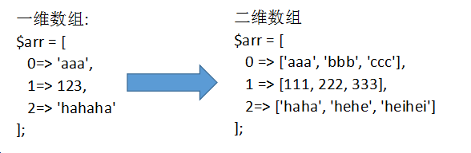

# **PHP核心编程-day2**  

每日目标:

- 能够声明数组、遍历数组
- 能够声明二维数组、遍历二维数组
- 能够说出什么是php超全局变量
- 能够使用get、post两种方式提交表单数据
- 能够说出get和post的区别
- 能够完成文件上传


# 1.数组

## 1.1 数组声明

  var  arr = [123, 'abc', 234];   console.log(arr[1]); 

   PHP的数组分为索引数组和关联数组两类:
     索引数组: ==下标是数字==的数组就是索引数组
     关联数组: ==下标是字符串==的数组就是关联数组 (重点)

   格式:
     $arr = array();
     $arr = [];

```
//声明索引数组
//               0         1         2
$arr1 = array('福禄娃', '海绵宝宝', '猪猪侠');
$arr2 = array(3=>'蜘蛛侠', 6=>'钢铁侠', 10=>'煎饼侠');
$arr3 = ['张无忌', '赵敏', '灭绝师太'];


//声明关联数组 -- 下标是字符串
$info = ['name'=>'张二狗', 'age'=>20, 'gender'=>'男'];
$goods_info = ['goods_name'=>'小米 8', 'goods_price'=>1999];
```


## 1.2 数组读写

   不管是索引还是关联数组，都是通过下标来进行读写控制的。

```
echo $arr2[6];
//下标是字符串，一定要加引号
// 如果不加引号就会变为常量
echo $info['name'];

$goods_info['goods_name'] = '小米 note 3';
```

​     

## 1.3 数组遍历

​    foreach 语句结构，用来遍历数组(关联数组和索引数组均可)。

​    格式: 

```
foreach($arr as $key=>$value){程序体}

foreach($arr as $value){程序体}
```

​      $arr : 要遍历的数组      
      $key: 单元的下标，可以是任意变量名
      $value: 单元的值，可以是任意变量名

```
<?php 
$arr = ['张无忌', '赵敏', '灭绝师太'];

//第一次循环，将第一个单元取出
//将单元的下标，赋值给$key
//将单元的值， 赋值给$value
//第二次循环，将第二个单元取出，赋值步骤同上
foreach ($arr as $key=>$value) {
    echo $key . "-" . $value . '<br>';
}


$goods_info = ['goods_name'=>'小米 8', 'goods_price'=>1999];
foreach ($goods_info as $k=>$v) {
    echo $k . '-' . $v . '<br>';
}

//如果as后面只有一个变量，该变量就是数组的单元值
foreach ($goods_info as $value) {
    echo $value;
}
?>
```


## 1.4 二维数组和多维数组

- 一维数组的单元中，保存了一个数组，那么该数组就是二维数组
- 二维数组可以想象成一个表格
- 二维数组同样也用下标来进行控制
- 二维数组常用来存储一组相似/相关的数据
- 二维数组的每个单元都保存一个一维数组，就是三维数组；三维数组的每个单元都保存一个数组就是四维数组； 依次类推，可以到n维。在一般开发中，最常用的是一维和二维数组，三维极少使用。





```
//同质数据
$list = [
  0=>['name'=>'zs', 'age'=>20, 'gender'=>'男'],
  1=>['name'=>'ls', 'age'=>21, 'gender'=>'女'],
  2=>['name'=>'ww', 'age'=>19, 'gender'=>'女'],
];
```


## 1.5 遍历二维数组

​     核心思想： 使用foreach取出第一维的数据（数组），第二层通过下标输出


```
$list = [
  0=>['id'=>1, 'name'=>'zs', 'age'=>20, 'gender'=>'男'],
  1=>['id'=>2, 'name'=>'ls', 'age'=>21, 'gender'=>'女'],
  2=>['id'=>3, 'name'=>'ww', 'age'=>19, 'gender'=>'女'],
];

//通常在实际开发当中，都只用一层foreach;
//第二层数据的显示，使用$value[下标]
//$value是一位数组
//第一次循环: $value = ['id'=>1, 'name'=>'zs', 'age'=>20, 'gender'=>'男'];
//第二次循环: $value = ['id'=>2, 'name'=>'ls', 'age'=>21, 'gender'=>'女'];
//第三次循环: $value = ['id'=>3, 'name'=>'ww', 'age'=>19, 'gender'=>'女']
foreach ($list as $key=>$value) {
    echo $value['id'] . ' ';
    echo $value['name']. ' ';
    echo $value['age']. ' ';
    echo $value['gender'];
    echo "<br>";
}
```


## 1.6 将数组输出成一个表格

方式一 : 使用echo来输出整体的表格结构，再用foreach来循环输出tbody中的结构和数据

```
$list = [
  0=>['id'=>1, 'name'=>'zs', 'age'=>20, 'gender'=>'男'],
  1=>['id'=>2, 'name'=>'ls', 'age'=>21, 'gender'=>'女'],
  2=>['id'=>3, 'name'=>'ww', 'age'=>19, 'gender'=>'女'],
];

echo "<table border='1' width='600'>";
echo "<thead>";
echo "<tr>";
echo "<th>编号</th><th>姓名</th><th>年龄</th><th>性别</th>";
echo "</tr>";
echo "</thead>";
echo "<tbody>";
//以第一次循环为例
//$value = ['id'=>1, 'name'=>'zs', 'age'=>20, 'gender'=>'男'];
foreach ($list as $value) {
    echo "<tr>";
    echo "<td>".$value['id']."</td>";
    echo "<td>".$value['name']."</td>";
    echo "<td>".$value['age']."</td>";
    echo "<td>".$value['gender']."</td>";
    echo "</tr>";
}
echo "</tbody>";
echo "</table>";
```


方式二: 提前定义好表格结果，只循环tbody中的内容

```
<?php 
//同质数据
$list = [
  0=>['id'=>1, 'name'=>'zs', 'age'=>20, 'gender'=>'男'],
  1=>['id'=>2, 'name'=>'ls', 'age'=>21, 'gender'=>'女'],
  2=>['id'=>3, 'name'=>'ww', 'age'=>19, 'gender'=>'女'],
];
?>
<table border="1" width="600" class="a">
    <thead class="b" style="color:red">
        <tr>
            <th>编号</th>
            <th>姓名</th>
            <th>年龄</th>
            <th>性别</th>
        </tr>
    </thead>
    <tbody>
        <?php foreach ($list as $value) { ?>
        <tr>
            <td><?php echo $value['id']; ?></td>
            <td><?php echo $value['name']; ?></td>
            <td><?php echo $value['age']; ?></td>
            <td><?php echo $value['gender']; ?></td>
        </tr>
        <?php } ?>
    </tbody>
</table>
```


## 1.7 print_r函数

   该函数不但能够输出基本类型，还能够输出数组，在项目开发时经常使用该函数查看数组中的所有数据。

   debug的核心思想就是跟踪变量，一段程序中所有变量中保存的是自己需要的数据，程序才在自己的掌控之下。

```
$info = ['id'=>10001, 'name'=>'张飞', 'age'=>21, 'gender'=>'男'];
print_r($info);
```


```
$list = [
  0=>['id'=>1, 'name'=>'zs', 'age'=>20, 'gender'=>'男'],
  1=>['id'=>2, 'name'=>'ls', 'age'=>21, 'gender'=>'女'],
  2=>['id'=>3, 'name'=>'ww', 'age'=>19, 'gender'=>'女'],
];
print_r($list);
```


使用 echo  来输出数组，则会得到以下错误


## 1.8 课后作业


数组应该是一个 二维数组， 需要保存3个数据，图片地址、人物名称、图片尺寸。

图片展示是 ul 和 li 组成。每一组li应该显示一组信息。


# 2. 超全局变量(预定义数组)

## 2.1 什么是超全局变量

​    超全局变量是PHP内置的变量，在每一个php文件中都可以直接使用。

​    特点: 
	在每个页面都能直接使用
	内部都是==关联数组==结构

```
非常重要: $_GET、$_POST、$_SESSION、$_COOKIE、$_FILES
知道: $_SERVER、$_REQUEST、$GLOBALS
```

 

## 2.2 $_SERVER

$_SERVER记录了服务器和客户端的主要信息，和当前页面的信息

 


重点记住的内容:

  REQURES_URI ： 访问的文件地址

  SCRIPT_NAME： 脚本名称（路径）

  PHP_SELF： 自身文件名

  访问的文件的绝对路径。 此处的绝对路径是和域名绝对

   /php2/code/server.php -->  localhost/php2/code/server.php


## 2.3 get/post方式接收表单数据

  表单处理通常需要两个页面：

​      1)  form.html，表单页，用户可以在表单页上填写相关数据

​      2)  form.php ,  数据接收处理页， 接收用户在表单填写的数据，然后做进一步处理


代码实现：

form.html


form.php


注意:  表单中每个域的name值，会作为$_POST的下标


  表单提交关键点总结:

  表单页: form.html

​    1) 必须有form表单标签，form必须有action 和 method 两个属性

- action: 指定表单数据提交的位置 ---  php/jsp/asp文件的路径
- method: 表单提交的方式， post 、get(默认)

​    2) 每个表单域都要有name属性    input   select   textarea

​    3) 必须有submit类型的按钮

   

   数据接收处理页： form.php

​    1) method=post时，使用$_POST接收数据    

​    2) method=get时，使用$_GET接收数据

​    3) 不管是`$_POST`还是`$_GET`，都是一个关联数组，数组的下标就是表单域中 name 属性的值


## 2.4 每种域和类型的提交方式

  表单标签： form 、 ==input 、 select 、 textarea==

  ==表单提交的实际上是每个域的value值==

  1) input  type= text/password/hidden/email  提交的就是value属性中的值

  2) input  type=radio  提交的是选中项的value值。==value必须设置，否则后端会接收 on==

  3) input  type=checkbox  ==在name的值后增加[] 转换成数组结构==，后端才能接收到所有的已勾选项

  4) select  name值需要定义在select标签中； value定义在option中，每条option都有自己的value

​                 如果不定义option中的value，则会将option中间的内容发送到后端页面中

  5) textarea  name值定义在textarea标签中，value没有显式的表示出来，就是开始标签和结束标签之间的内容


## 2.5 post和get的区别 (非常重要)

==通过URL地址栏来区分post和get==

get将提交数据拼接成字符串显示在URL地址栏中


post不显示


 

1) 提交方式

- get会将数据显式的拼接到url地址栏中  (字符串)

  例如： form.php==?==id=10001==&==username=heiheihei==&==passwd=123456&key=value....
  key=value方式传参，多个参数之间使用&符号隔开

​         id、username、passwd等等（键/key）都是表单域的name值

​         1、heiheihei、123456等等（值/value）都是表单域的value值

- post不会显示出来

2) 传递数据量大小

- post最小值是2M，默认8M，可以通过修改php配置(php.ini)文件来修改大小，理论上没有上限的。

- get会受到浏览器的地址栏的限制。有的是2k，有的是8K(chrome)

3) 应用范围不一样

- post在绝大多数情况下都使用在表单提交中。

- get的应用范围比较广。在a标签的href中，location.href中等都能使用get方式。


 

## 2.6 $_REQUEST

   $_REQUEST 即可以接收get方式提交的表单，也能接收post方式提交的表单。但是因为速度比较慢，所以现在被弃用。


# 3. **文件上传**

  文件上传属于一种特殊的表单提交，也需要两个页面 ---  表单页  和   数据处理页。


upload.html表单页


upload.php 上传文件处理页


文件上传核心点总结:

 核心点一：表单设计 

​	表单标签form中必须额外增加 enctype属性，必须使用post提交表单

​	文件域必须有name属性和值


 ==核心点二  ---  $_FILES==

$_FILES是一个二维数组，保存了上传文件的相关信息：

 第一维下标是 文件域的name值

 第二维有5个固定单元

   name: 上传的文件名

   type: 上传的文件类型

   tmp_name: 上传文件在服务器临时存储的路径

   error:  错误码，错误码有0-4  5个值。 等于0时，代表文件正常上传

​      0：代表正常上传，没有错误

​      1：代表上传文件大小超过了 php.ini中 upload_max_filesize 定义的大小

​      2：代表上传文件大小超过了 php.ini中 post_max_size 定义的表单最大值

​      3：文件只有部分被上传 

​      4：没有文件被上传 

   size: 上传文件的大小  bit


 ==核心点三  ---  move_uploaded_file==

从$_FILES中我们可以知道，文件已经正常上传到服务器了。

所以，接下来就需要将文件从临时保存路径，移动到我们希望保存的路径中。

move_uploaded_file (参数1， 参数2)；

 参数1: 临时路径  --->  `$_FILES['pic']['tmp_name']`

 参数2: 目标路径  --->  使用相对路径移动到当前目录下   ./ 


作业2： 只允许上传图片 （jpg  png  gif）

字符串截取:  strpos   substr

数组函数:  in_array