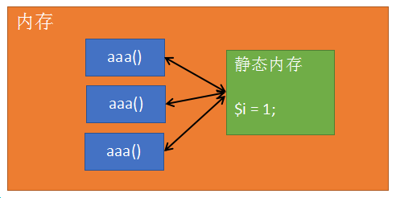
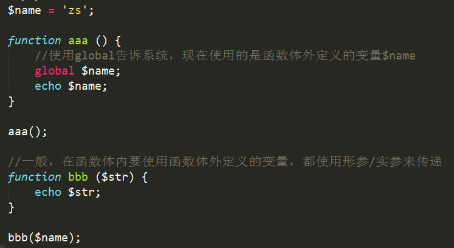
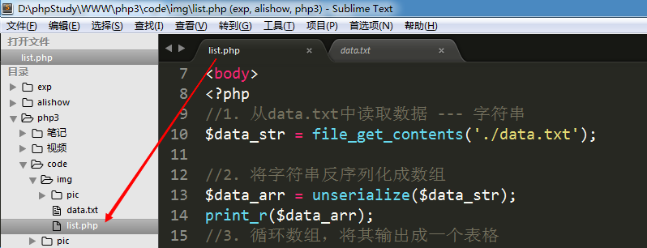
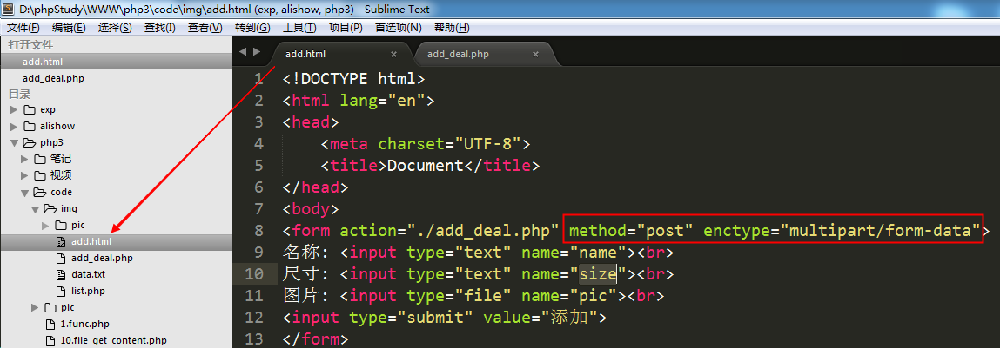
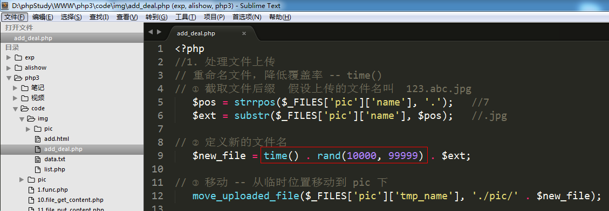
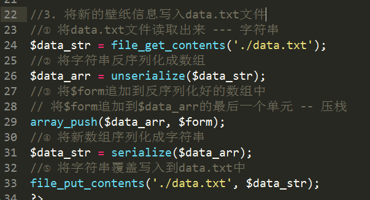

# PHP核心编程-day3

每日目标

- 掌握PHP函数声明和调用方法
- 掌握PHP中变量作用域规则
- 掌握文件引入的四个函数
- 掌握PHP的常用函数
- 能够完成壁纸列表和添加壁纸操作


# 1. 函数

## 1.1 什么是函数？

   函数（function）是一段完成指定任务的已命名代码块

   PHP函数包括内置函数（系统函数）和自定义函数两类


## 1.2 函数的格式

   PHP声明函数的方式和Javascript一致。 

```
function  函数名称（[参数1 [,参数2 [,…]]]）
{
	函数体;
	
	//如需函数有返回值时使用
	[return 返回值;]
} 
```


## 1.3 变量的作用域

  核心概念: 在函数体外定义的变量，在函数体内无效
 	  	   在函数体内定义的变量，在函数体外无效


  全局变量 和 局部变量:
	局部变量:  函数体内的变量，该变量只在函数范围内有效。
	全局变量:  函数体外的变量，在整个php文件中都有效（除了函数）。


## 1.4 文件包含

  文件包含一共有4个函数:   include、include_once、require、require_once
  ==文件A中包含文件B，那么文件B就相当于文件A的一部分。==

  注意事项: 
    如果文件A和文件B定义了相同的变量，则会发生覆盖。
    如果文件A和文件B定义了相同的函数，则会发生致命错误。


​    include             require

​    include_once   require_once


四个语句的区别：

1) include在包含一个不存在的文件时，会产生一个Warning错误，程序不会中断继续执行；而require会产生Fatal错误，中断执行。

2) include_once和require_once的区别：include_once只会加载一次相同的文件，而inlcude会加载多次。

3) 在实际开发中基本使用 include_once或者require_once


## 1.5 static静态变量

   当一个变量使用static进行修饰时，该变量在整个php页面运行过程中只有一份。

  


​    每次调用 aaa() 函数时，都会去静态内存区寻找是否有 `$i`。如果没有，则创建`$i`并进行赋值；如果有，则直接使用，跳过赋值过程。

​    static在递归操作中非常有用。


## 1.6 global全局变量

​    如果在一个函数体内想强行使用函数体外定义的变量，可以使用global关键词来声明。



  

​      $GLOBALS的功能和global差不多，都不推荐使用。


# 2. 常用函数

##  2.1 日期函数

```
int time():  获取当前时间点的时间戳 -- 1970.1.1 00:00:00 到现在的秒数
string date(format $str, timestamp $int): 可以将时间戳转为年月日时分秒的形式
```

2018-08-11 10:10:10


```
date函数说明：

参数1: 要显示的时间格式
参数2: 时间戳, 可选参数, 如果不指定则为当前时间戳
返回值: 指定的时间格式

时间格式参数:
Y: 4位年
m: 带前导0的2位月
d: 带前导0的2位日
H: 带前导0的2位时
i: 带前导0的2位分
s: 带前导0的2位秒

修改时区有两种方法:
1)  使用函数 ---- date_default_timezone_set();      临时修改
2)  修改php配置文件 php.ini                         永久修改
北京时间: PRC (中国人民共和国)  或者  asia/shanghai (亚洲/上海)
```


在php.ini文件中永久修改时区的配置项


重启apache服务器，才能使最新的配置项生效。 （只要修改过Apache或者php的配置文件，就都需要重启Apache服务器才能生效。Apache配置文件 httpd.conf）


##  2.2 变量函数

```
bool empty($var): 判断变量是否为空。如果为空返回 true；反之，则返回false
bool isset($var): 判断一个变量是否被设置。 如果已设置返回true，反之，返回false
void unset($var): 删除变量，无返回值
```


##  2.3 数组函数

```
bool in_array(mixed, arr):  检查一个值是否存在于一个数组当中
array explode(delimiter, str): 使用一个字符串将另一个字符串分割为数组
string implode(str, arr):  使用一个字符串将一个数组链接为字符串
```


## 2.4 字符串函数

```
int strlen(str):  获取字符串长度
int strpos/strrpos($str, $char): 查询$char字符串在$str字符串中的第一次/最后一次出现的下标
string substr（str, start[, length]）:  字符串截取
string str_replace（search, replace, str）:  字符串替换
string trim（str）:  删除字符串左右两边的空格
void die/exit([str]): 结束当前脚本
```


# 3. 文件读写

## 3.1 读取文件内容

```
string  file_get_contents(string $file);
参数: 文件路径，可以是本地文件的路径，也可以是网络地址
返回值: 文件内容
```

```
/**
 * 获取文件内容
 * 参数: 要获取的文件的路径，该路径可以是本地文件路径，
 *       也可以是网络文件路径
 * 返回值: 文件内容
 */
echo file_get_contents('./data.txt');

echo file_get_contents('http://s1.bdstatic.com/r/www/cache/static/home/css/index.css');
```


## 3.2 向文件中写入内容

```
int file_put_contents(string $file, string $data[, constants flag]);
参数1: 文件路径
参数2: 要写入文件的字符串
参数3: 可选参数，默认不写，新内容覆盖原文件中的内容；FILE_APPEND是向文件中追加内容
返回值: 写入文件的字符串长度
```


## 3.3  序列化 和 反序列化

   file_put_contents函数不能将数组直接写入文件，因为数组不能直接转化为字符串。

   string  ==serialize==($arr):   将数组转为字符串，该字符串是一种特殊结构的字符串。
   array  unserialize(string):   将序列化的字符串转为数组


序列化:

```
$arr = [
    ['name'=>'张飞', 'size'=>'1920*1200', 'path'=>'./pic/11.jpg'],
    ['name'=>'吕布', 'size'=>'1920*1200', 'path'=>'./pic/10.jpg'],
    ['name'=>'安琪拉', 'size'=>'1920*1200', 'path'=>'./pic/6.jpg'],
];

/**
 * 能将数组转为带有数组结构的字符串
 */
echo serialize($arr);
```


结果:

```
a:3:{
  i:0;a:3:{
   s:4:"name";s:6:"张飞";
   s:4:"size";s:9:"1920*1200";
   s:4:"path";s:12:"./pic/11.jpg";
  }
  i:1;a:3:{
   s:4:"name";s:6:"吕布";
   s:4:"size";s:9:"1920*1200";
   s:4:"path";s:12:"./pic/10.jpg";
  }
  i:2;a:3:{
   s:4:"name";s:9:"安琪拉";
   s:4:"size";s:9:"1920*1200";
   s:4:"path";s:11:"./pic/6.jpg";
  }
}
```


反序列化:

```
$str = file_get_contents('./data.txt');

/**
 * 将结构化好的字符串转回成数组
 * 参数: 结构化好的字符串
 * 返回值: 数组
 */
$arr = unserialize($str);
print_r($arr);
```


结果:


# 4.  综合案例--壁纸管理

## 4.1 壁纸列表

目标：以表格形式将data.txt文件中所有的数据展示出来


思路分析：  

  1) 从文件中读取数据 --- 字符串

  2) 将字符串恢复成数组结构(unserialize) --- 二维数组  

  3) 循环将数据进行输出


代码实现:




## 4.2 添加新壁纸


 思路分析:  三个文件完成该功能    表单页 、 数据处理页 、 数据保存文件

​    1) 表单页（upload.html）

​         保证数据能够正常提交，文件能够正常上传

​    2) 数据处理页 (upload.php)

​	① 文件上传
	② 接收表单数据
	③ 将数据写入data.txt文件

​             i.  将接收到的数据构造成一个一维数组 ($info)

​             ii. 将data.txt文件中原有的数据取出，反序列化成二维数组 （$list）

​             iii. 将`$info` 追加到 `$list`中

​	     iv. 将$list序列化后，再写回data.txt文件（覆盖）

​    3) 数据保存页 (data.txt)

​        在该文件中保存的数据必须是被序列化过的数组

 

  代码实现:

   add.html




 add_deal.php







  关键点总结：

  1) 表单页（upload.html）

​     表单要上传文件，所以必须有  enctype属性，必须使用post进行数据提交

  2) 数据处理页（upload.php）

​     ① 因为上传的必须是图片，所以要做检测上传文件类型，还要重命名文件防止覆盖
     ② 创建数组用来保存表单接收的数据，数组应该有三个单元 (name  size  url)
     ③ 要先将data.txt文件中的数据读出来。如果文件为空，则创建一个空数组，再将表单提交的数据追加到数组中；如果文件不为空，则反序列化成一个数组，再将表单数据追加到数组中。
     ④ 将追加后的新数组序列化，再写入data.txt文件中

