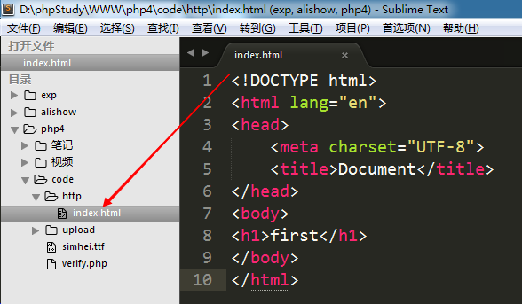
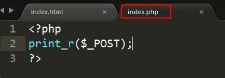
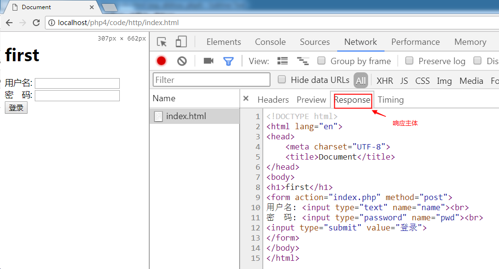
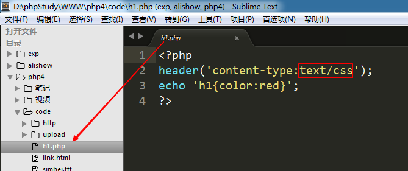
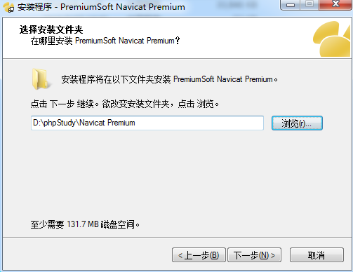
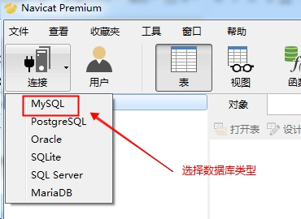
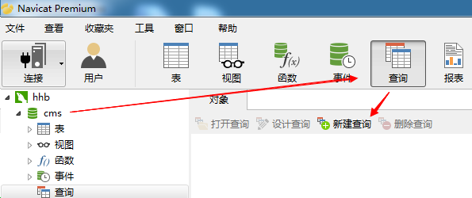
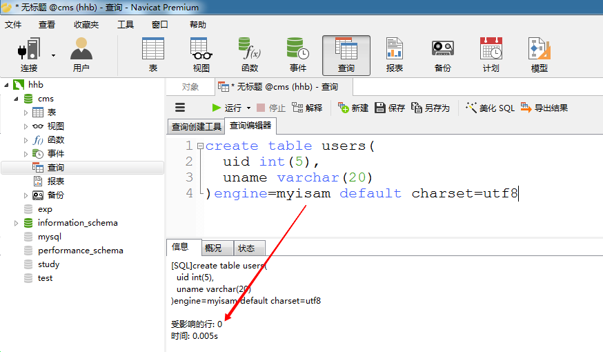

# PHP核心编程-day4

每日目标

- 能够说出什么是Http协议
- 能够说出什么是请求什么是响应
- 能够列举常见的状态码
- 能够安装Navicat客户端
- 能够掌握MySQL数据库的基本结构


# 1. Http协议

##  1.1 Http协议概述

  协议: 就是事先的一种约定、规则、规范、标准。（租房合同、工作合同）。

  HTTP协议：HyperText Transfer Protocol 超文本传输协议，客户端（浏览器端）与WEB服务器端之间的交互协议。当浏览器和服务器进行数据交换时，html文件、图片、CSS、JS等都是基于HTTP协议进行传输的。

  HTTP协议有两个版本: 1.0 和 1.1，目前使用的基本都是1.1

  特点: 
	通常是基于 B/S 结构软件的。
	无连接: 浏览器向服务器发送一次请求，服务器响应一次，链接即结束。
	无状态: 无记忆。 服务器不能记住哪个浏览器访问过。 

  

无连接 -- 没有持久化链接

当浏览器地址栏输入 www.baidu.com/index.html，按下回车时。浏览器向服务器发送请求，服务器找到index.html文件返回给浏览器之后，本次链接断开。

如果在点击该页面中任何一个链接，则重新建立一次链接。客户端发送请求，服务器响应。之后又断开链接。 


##  1.2 请求和响应

HTTP协议主要分为两大部分: 
	请求:  访问服务器的任何一个文件都是一次请求
	响应:  服务器处理请求，将结果返回给浏览器。

1) 请求(==request== / http request)
	客户端(浏览器)向服务器索要数据时遵循的协议

 	请求分为3个部分:  请求行   请求头   请求主体

​	请求行:  请求方式、请求URL地址、协议版本号
	请求头:  主机域名，客户端(浏览器)的信息等
	请求主体:  发送给服务器的数据，get和post都会通过请求主体将数据发送给服务器

 	可以使用Chrome tools 或者 firebug 来查看请求和响应的信息（F12）

​       

​        主要请求项:

​	  host： 主机名和端口号，80端口默认不显示
	  accept：可接受的程序类型
	  accept-encoding： 可接受的压缩类型
	  accept-language： 可接受的语言类型
    	  cache-control： 缓存控制


案例1:  访问 localhost/php4/code/http/index.html 文件




通过F12进行查看


点击 index.html就能看到右侧的三个信息


案例2:  index.html表单数据提交到index.php文件





post方式提交的数据叫  FormData，以字符串形式将数据进传递


案例3:  index.html页面中a标签跳转到get.php文件


get传值叫做  Query String Parameters


 

2) 响应(==response== / http response)

​	响应也分为3部分:  响应行   响应头   响应主体

​	响应行: 协议版本号、响应结果==状态码==
	响应头: 主要是服务器端的信息
	响应主体: 就是从服务器返回给客户端的数据

​        主要响应项：

​	  content-type： 响应内容类型， content-type:text/html，服务器告诉浏览器，返回的这部分数据是文本类型，使用html方式来解析即可。
	  content-length： 响应内容的长度 ，content-length:336, 从服务器返回给浏览器的数据总长度为336字节


案例1: 访问 localhost/php4/code/http/index.html 文件时的响应信息





案例2: index.html表单数据提交到index.php文件的响应信息


案例3: index.html页面中a标签跳转到get.php文件的响应信息

 


##  1.3 状态码

 常见的状态码如下: 

 200 ok   -----   请求成功

 302 redirect|Found  ----- 重定向

 304 not modified ----- 缓存文件

 403 forbidden   -----  禁止访问 （没有权限访问）

 404 Not Found  -----  未找到页面

 500 internal server error  ----- 服务器内部错误 (可能是服务器本身有问题，或者代码错的太离谱)

 

##  1.4 header响应头设置

1) 设置响应类型

​    浏览器发起请求的方式是多样的，当发起请求后服务端会有对应的内容响应过来，浏览器会根据响应头==Content-Type==来对响应的内容进行解析

​    content-type主要的响应类型是  text/html   
    其他常见类型 :  text/css   text/javascript   image/png  image/jpeg  image/gif

​     注意: 所有的响应类型都是  大范围/小类型， 千万不能写反


案例1: php绘制的验证码 verify.php


如果改为 text/html


案例2: link标签发送请求 

① 创建html文件，使用link标签引入一个php文件


② 在h1.php文件中，设置响应类型（content-type为css）




访问结果:


2) 指定字符集

   中文字符集: utf-8  gb2312  gbk

​     header(‘Content-Type:text/html;charset=utf-8’);
     header(‘Content-Type:text/html;charset=gb2312’);

 

   页面乱码问题处理方式：
     页面乱码是因为==文件编码==和==页面指定编码==不一致，所以解决该问题就是要==统一文件编码和页面指定编码==

​     ① 在页面中设置 header ，编码指定为 utf-8
     ② 将文件的编码格式，指定为utf-8 (使用sublime，将保存格式设置为 utf-8 或者 使用editplus另存为文件时，设置utf-8)


如果 header设置为 utf-8，则文件编码格式也要设置为 utf-8

如果 header设置为 gbk，则文件编码格式要设置为 ANSI 


① 在sublime创建charset_utf8.php


访问结果:


② 在windows中直接创建 charset_gbk.php


访问结果:


原因:

  sublime创建的文件是utf-8编码的，和页面中header设置的字符集一致，所以能正常显示。

  windows创建的文件是ANSI编码的, 而页面中header设置的字符集是utf-8，两者不一致，所以乱码了。


解决方案:

  ① windows创建的文件，header要设置为 gb2312或者gbk

  ② 将windows创建的文件，改为utf-8编码


修改文件编码可以使用editplus或者sublime都行


现在我们常用的sublime和vs，创建的都是utf-8编码格式的文件，所以，header要设置为 utf-8


3) 页面重定向

​     header('location:页面地址');
     header('refresh:2;url=页面地址');


扩展内容:


# 2. MySQL数据库服务器

##  2.1 什么是数据库

存储数据的仓库。

常见的数据库: MySQL、 Oracle、 Sqlserver、 DB2等。

##  2.2 MySQL简介

MySQL是一个关系型数据库管理系统，由瑞典MySQL AB 公司开发，目前属于 Oracle 旗下产品 

MySQL结构：

 

在一个MySQL服务器中有多个数据库，每个数据库又有多个数据表。 数据是存储在数据表当中的。

数据表的结构和excel一模一样

 

表结构:  

   和excel表的结构是一样的。
   每一列都是一类数据 --- 字段
   每一行代表一条数据 --- 记录

 

##  2.3 安装客户端

MySQL是一款C/S结构的软件。

MySQL本身是服务器端。

常见的客户端: CMD 、 Navicat、 Sqlyog、 phpmyadmin等等


安装 Navicat

1）解压

 

 

2) 选择安装版本

 

3)选择安装路径



 

继续下一步...

 

4)链接服务器

 

 ① 点击“链接”按钮 ---  选择要链接的数据库种类

 

 

 ② 配置链接信息

   用户名： root       该用户是MySQL服务器系统的最高用户，拥有该系统的所有权限
   密码：  root             phpstudy中MySQL系统root用户的默认密码

 

 

  ③ 点击“localhost”结果

 

 

左侧的localhost下的内容都是数据库名称。

  information_schema、mysql、performance_schema 这三个是系统数据库。
  其他的都是自建数据库

看到上图，说明已经使用navicat 客户端正常链接到了 MySQL服务器了。


# 3. 创建/删除数据库

操作数据库需要使用SQL语句（结构化查询语言）

1) 创建数据库

​    语法格式: create database 库名;

​    示例: create database study;   创建一个名为 study的数据库

​              create database cms:     创建一个名为 cms 的数据库


2) 删除数据库:

  语法格式:  drop database 库名;

  示例:     drop database school;  删除school库

​                drop database cms;      删除cms库


# 4. 创建数据表

## 4.1 创建表的基本格式

语句格式:

CREATE TABLE 表名 (
       列名     数据类型(长度)    完整性约束条件,
       列名     数据类型(长度)    完整性约束条件,
       ......
) engine=myisam default charset=utf8

 

==注意事项:==
   ==列名、数据类型、长度是必有的； 完整性约束条件可以没有==
   ==最后的 utf8 没有 -==


## 4.2 创建用户表 -- users

案例:  在cms数据库中，创建一张users数据表，该表中只保存用户id和用户名两个字段

==一定要先选中 cms 库，再去打开查询编辑器== 







uid   int (5) :  uid字段是整型的，长度是5 (0--99999)

uname varchar(20): uname字段是字符串类型，长度是20 


# 5. 数据类型和完整性约束条件

## 5.1 数据类型

1) 整型:   int

​    tinyint（微整型 -128~~127）  
    int(-2,147,483,648  ~~ 2,147,483,647)

 2) 字符串:

​     varchar: 可变长度  varchar(30)    存储abc，varchar会占用3位长度
     char: 固定长度     char(30)    存储abc，char会占用30位长度
     char的执行速度比varchar快，所以能用char就用char

3) 枚举:  enum （单选）  

​    enum(‘男’, ‘女’, '人妖')   
    enum(‘武侠’, ‘玄幻’, ‘恐怖’, ‘都市言情’)


   set(多选)

   set('古装','喜剧','警匪','恐怖','穿越','动作')


4) 日期:  

​    date :   年-月-日
​    datetime :  年-月-日  时:分:秒
    (time： 时:分:秒)
    int: 存储时间戳


5) 文本: text  大文本


## 5.2 完整性约束条件

 完整性约束条件，就是进一步限制字段中保存的数据

1) unsigned: 无符号，只用在整型字段上。

   tinyint unsigned  无符号微整型 0~~255 

   int unsigned  0~~42亿

2) auto_increment: 自增长，只用在整型字段上。 

3) primary key: 主键。 

​      主键: 用来标志唯一一行数据的。

​      特点:  唯一 、 非空 、经常和auto_increment结合使用。 主键和自增长配合就能确定唯一的一条数据了。 主键一般都会选择整型字段。

4) unique: 唯一。 该列中不能出现重复值

5) not null: 非空。 该列中不能有 NULL 数据。	


## 5.3 创建管理员基本信息表 （ali_admin）

  所需字段:
    id:  整型 无符号  自增长  主键
    邮箱(账号、用户名):  字符串  唯一  非空
    昵称:  字符串  唯一 非空
    密码:  字符串  非空  md5加密(32位固定长度)
    手机:  字符串
    性别:  枚举，男、女、人妖
    生日:  日期  (date  datetime  int)
    年龄:  微整型，无符号
    个人介绍: 文本
    添加时间:  整型，记录时间戳


```
create table ali_admin(
  admin_id int UNSIGNED auto_increment primary key,
  admin_email varchar(30) UNIQUE not null,
  admin_nickname varchar(30) UNIQUE not null,
  admin_pwd char(32) not null,
  admin_tel char(11),
  admin_gender enum('男','女','人妖'),
  admin_brith date,
  admin_age tinyint unsigned,
  admin_sign text,
  admin_addtime int UNSIGNED
)engine=myisam DEFAULT charset=utf8;
```


