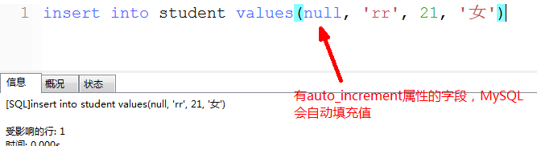
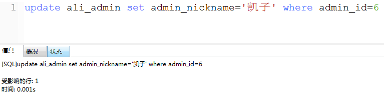
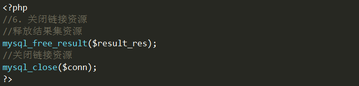
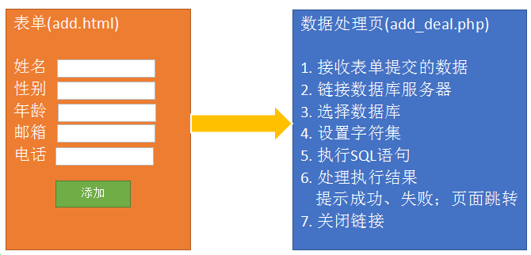
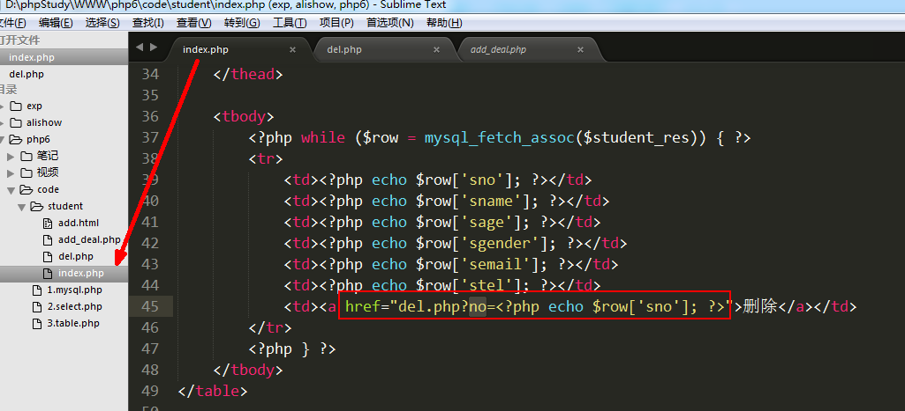

# **PHP核心编程-day6**

每日目标

- 能够完成学生信息列表页

- 能够添加新学生信息

- 能够删除学生信息

- 能够修改学生信息

# 添加数据

格式： insert  into  表名(字段1，字段2，...)  values(值1，值2，...);

关键点:

   1) 字段和值需要一一对应，如果不对应会造成添加失败或者数据错误
   2) 如果每个字段都有数据，则不需要在表名后设置字段列表
   3) 带有auto_increment属性的字段可以使用null来设置，MySQL会自动填充数据


案例1: 向student表添加一条数据


方式一:


方式二:


方式三: 




# 修改数据

格式:  

  update  表名   set   字段1=值1, 字段2=值2,...  where  修改条件

  修改表中的哪一条（几条）数据的 字段1=值1...

 

案例2: 将id为6的管理员昵称改为凯子




案例3: 将所有男性管理员的年龄都+1

表: ali_admin

字段: admin_age

修改条件: admin_gender='男'


# 删除数据

格式:  delete from 表名  where 删除条件

 

案例4: 删除cate_id=5的栏目


# 1. PHP操作MySQL

   PHP当中一共有三组函数可以用来操作MySQL服务器： mysql    mysqli   pdo


   PHP操作数据库是固定流程，一共6步:

   1) 链接MySQL服务器  

   2) 选择要操作的数据库

   3) 设置字符集 （不设置字符集可能会出现乱码问题）

   4) 执行SQL语句

   5) 处理SQL执行结果

   6) 关闭MySQL链接

   除了第五步，其他每一步都是固定的，对应一个mysql的函数


   1) 链接MySQL服务器 --- mysql_connect(var1, var2, var3)

  参数1: MySQL数据库的主机地址
  参数2: MySQL用户名  （root）
  参数3: 用户名对应的密码
  返回值: 数据库链接资源

  `$conn = mysql_connect('localhost', 'root', 'root');`

 

   2) 选择要操作的数据库  --- mysql_select_db(var)

  参数1: 数据库名称

 `mysql_select_db('demo');`

 

   3) 设置字符集 --- mysql_query(var);

  参数1: sql 语句 ----  set names utf8  (设置字符集的sql语句)

  `mysql_query('set names utf8'); `


   4) 执行SQL语句 --- mysql_query(var);

  参数: sql 语句 ----  增删改查SQL语句
  返回值: 如果是查询，则返回结果集（资源），该资源里面包含了从数据表中取出的数据
                如果是增删改，则返回布尔值，执行成功返回true，失败返回false

  `$result = mysql_query($conn, $sql); `


   5) 处理**==查询结果==**

  **==mysql_fetch_assoc(var);==**

  参数: 查询结果集（资源）
  返回值: 一维数组，下标是数据表字段

  将当前行的数据取出并返回成一维数组，同时将指针向下移动一行。
  如果已经无法返回一维数组时，则返回false 


   6) 关闭MySQL链接资源 --- mysql_close(var)

   参数: 数据库链接资源


案例: 向test库中的student表中，增加一条数据


 案例: 查询student表，并将数据以表格形式显示在网页上





核心: mysql_fetch_assoc的执行原理


# 2. 学生信息管理系统

**==目标: 通过PHP网页来管理数据库，对数据表的数据进行增删改查==**

  数据表设计:

​    sno： 学号  整型  无符号  主键  自增长
    sname： 姓名  字符串
    sage： 年龄 无符号 微整型
    sgender： 性别 枚举
    semail： 邮箱
    stel： 电话


​    create table student(
	sno int UNSIGNED auto_increment PRIMARY key,
	sname VARCHAR(30) not null,
	sage tinyint UNSIGNED not null,
	sgender enum('男', '女') DEFAULT '男',
	semail varchar(30),
	stel   char(11)
    ) engine=myisam DEFAULT charset=utf8;


测试数据:

INSERT INTO `student` VALUES ('1', '赵老四', '30', '男', 'zls@a.com', '13512345678');
INSERT INTO `student` VALUES ('2', '王翠花', '28', '女', 'wch@b.com', '13612345678');
INSERT INTO `student` VALUES ('3', '孙狗剩', '32', '男', 'sgs@c.com', '13712345678');


## 2.1  学生信息列表

 核心SQL:  select  *  from  student

 将student表的数据以表格形式显示在网页上


 1) 从student表中获取数据


2) 将获取的数据显示表格


3) 释放资源


## 2.2  添加学生信息

 核心SQL:  insert into student values(null, '路飞', 10, '男', 'lf@dasd.com', 18012345678);




代码实现:

add.html  ----   提供一个可以填写的表单


 add_deal.php

  1) 接收表单数据

  2) 拼接SQL语句

  3) 链接MySQL服务器并执行SQL语句

  4) 处理SQL执行结果： 判断结果，如果是true说明添加成功，如果是false说明添加失败

  5) 关闭数据库链接


##   2.3 删除学生

 核心SQL:  ==delete from student where sno=**5**==

 


步骤: 
   1) 在学生信息列表页(index.php)，为每一行都添加一个删除按钮，删除按钮可以跳转到另一个php(del.php)页面，在跳转时，将当前行的sno一起传递到del.php页面。





   2) del.php页面，接收sno，拼接删除的sql语句，再执行该SQL。再根据删除结果提示删除成功/删除失败。跳转回学生列表页。

  ① 接收学号 sno

  ② 拼接删除的SQL语句

  ③ 链接MySQL服务器并执行SQL语句


# 3. mysql其他函数

```
array mysql_fetch_row($resource)     功能同mysql_fetch_assoc，但取出的索引数组
array mysql_fetch_array($resource)   功能同mysql_fetch_assoc，但取出关联和索引的混合数组

int  mysql_num_rows($resource)  获取查询结果集中的行数
int  mysql_num_fields($resource)  获取查询结果集中的字段数
```

