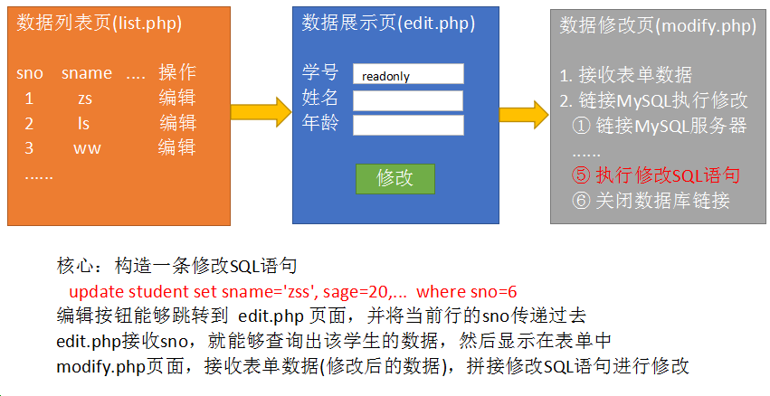
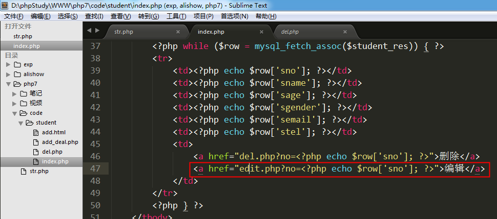
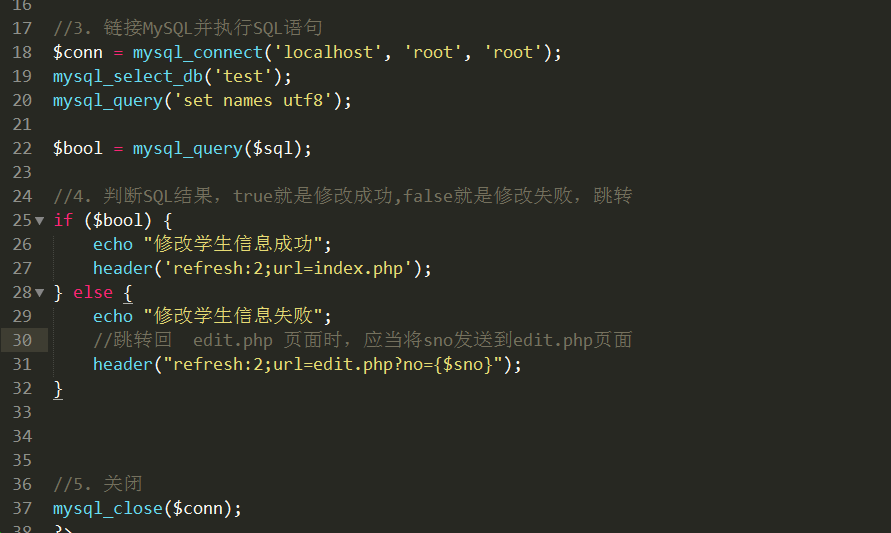
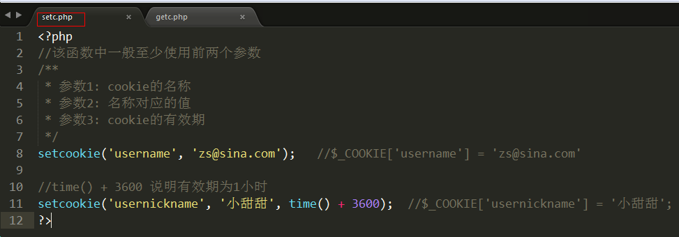
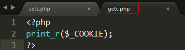
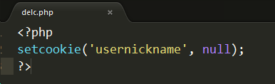

# PHP核心编程-day7

每日目标

- 说出什么是cookie以及cookie的原理

- 说出什么是session以及session的原理

- 能够完成学生管理系统的登录操作

  

# 1. 修改学生信息

核心：构造一条修改数据的SQL语句   

   ==update student set sname='', sage=''..  where sno=6==

步骤:

 1) 在学生列表页(list.php)为每一行都添加一个“编辑”按钮，跳转到编辑表单页(edit.php)，并且要将当前行的sno一起传递到edit.php页面。

 2) 创建edit.php页面(和add.html页面结构一样)，接收sno，拼接SQL语句并执行，得到一个一维数组，将该数组的值填充到表单中。

  ① 接收sno

  ② 根据sno 查询学生信息

  ③ 将学生信息显示到表单中  -- 将add.html中的表单复制过来，稍作修改即可

  ④ 保证表单能够提交到modify.php页面即可

 3) 创建一个修改页面(modify.php)，接收edit.php页面表单中的值，拼接一个修改的SQL语句，执行该SQL语句。根据修改结果提示修改成功/修改失败，再跳转

 ① 接收表单提交的数据

 ② 编写修改的SQL语句 --- update

 ③ 链接MySQL服务器并执行SQL语句

关于排错: 

​     核心思想: 如果一个程序中有SQL语句执行，那么该程序出现错误，第一反应去检查SQL语句。

​     检查方法:

​          1) 在php页面中使用echo 将sql语句进行输出

​           2) 在页面上复制SQL语句到navicat中进行测试

   第一步:

  第二步:

  第三步:

  将SQL语句复制到navicat中执行，获取错误信息。

# 2. 登录

 

验证逻辑:

 1) 根据用户名从ali_admin表中查询数据。如果有结果，则说明用户名正确；反之，说明用户名错误。

 2) 登录表单提交密码和上一步查询出的密码进行比对，两者相等说明密码正确；反之，密码错误。

 代码实现:

1) 创建login.html 登录表单页

2)  创建check.php文件

  ① 接收表单提交的数据

  ② 验证用户名是否正确

​      核心思路:  根据接收的用户名查询ali_admin表，如果能够查询到数据，说明用户名正确；反之，查询不到数据说明用户名错误。

​       核心SQL: ==select * from ali_admin where admin_email='$email'==

​       该SQL语句的执行结果，只能是0条数据 或者 1条数据

  ③ 验证密码是否正确

   核心思路:  验证从数据表中查询出的数据中的密码和表单提交的密码是否一致。如果一致，则说明密码正确，可以正常登录；反之，说明密码错误，跳转到login.html页面

测试: 直接访问 list.php页面，依然可以看到页面结果。 因为http协议是无记忆协议，不知道哪个浏览器来过，所以没办法限制是否能够正常访问到哪个页面。

要实现限制的功能，必须配合 ==会话控制== 技术

#3. **会话控制概述**

1) http协议的缺陷

​     无状态，就是无记忆，不能让同一浏览器和服务器进行多次数据交换时，产生业务的连续性。

2) 什么是会话控制

​     会话控制就是解决http无记忆的缺陷的。能够==将数据持久化的保存在客户端(浏览器)或者服务器端==，从而让浏览器和服务器进行多次数据交换时，产生连续性。

3) 会话控制的分类

​    分为两种: cookie（客户端）  和  session（服务器端）

cookie应用实例 --- 千人千面（猜你喜欢）

不同的用户访问优酷服务器所看的视频类型不一样。 服务器会将浏览器观看过的视频的关键词保存到浏览器的cookie中（文件、内存）。当浏览器再次访问优酷服务器时，服务器会从cookie中读取关键词，再根据关键词推荐视频。

session应用实例 --- 支付宝

每个用户访问支付宝进行登录时，用的是同一套程序。服务器会为每一个浏览器进行编号(sessionid)，当用户登录成功后，服务器会创建一个区域(文件、内存服务器)用来保存用户信息。等浏览器下一次访问服务器时，服务器先拿到浏览器的编号，再和已有的编号进行比较，找到相同的区域（文件、内存服务器）。

# 4. cookie技术

##  4.1 什么是cookie？

   cookie是将数据持久化存储到客户端的一种技术。

   网站可以将数据写到浏览器中， 一个网站最多能在一个浏览器写20个cookie。

   一个浏览器能够设置的总cookie数最多为300个，每个不能超过4kb。

   cookie既能保存在文件中，也能保存在内存中。

##  4.2 设置/读取cookie

 1) 设置cookie

   setcookie(var1 , var2, var3);
   var1: cookie的名称
   var2: 名称对应的值， 可选参数
   var3: cookie的有效期， 可选参数

 

2) 读取cookie信息

   使用php的超全局变量 $_COOKIE进行读取

通过浏览器查看cookie信息:

## 4.3 cookie有效期

  setcookie函数的参数3可以控制cookie有效期
	参数3设置为-1 或者 不设置，关闭浏览器即失效
	参数3设置为 time()+秒数，则在当前时间点的多少秒之后失效

  设置cookie时，如果设置了有效期，则cookie会保存在文件中；如果没有设置有效期，则cookie保存在内存中。

## 4.4 cookie的有效范围

​    ==setcookie函数还有参数4、5，可以用来控制cookie的有效访问，但是**一般不用**。==

只需要记住下面的情况即可：    
    在不使用参数4和5的情况下，cookie在当前目录及子目录中有效，在上层目录中无效。

## 4.5 cookie删除

​    setcookie函数第二个参数设置为null，就可以删除cookie
    setcookie('name', null);

## 4.6 js控制cookie

cookie是将数据保存在客户端的，所以可以使用javascript来读取/设置cookie。 

​   设置cookie:   document.cookie = “名称=值;expires=时间”
​   读取cookie:   document.cookie

读取cookie:

设置cookie:

  expires: 用来指定cookie有效期的

# 5. session技术

## 5.1 session介绍

因为cookie是保存在客户端的数据，不够安全，所以出现了session。
session会将数据保存到服务器端（保存在==文件==、内存服务器或数据表中），安全性就可以得到保证。

## 5.2 设置/读取session

   重点:
	php使用session时，首先要使用session_start()函数来开启session。
	$_SESSION 超全局变量就能设置和读取session中的内容

1) 设置session

   将session作为数组操作就可以。

2) 读取session

## 5.3 session作用范围

   在当前网站的任何一个页面设置过session，则该网站的所有页面都能得到该session的数据
   例如: 在 www.jd.com 的某个页面中设置session，那么在jd网站的任何一个页面都能找到该session
             同理，在localhost的某个页面中设置session，那么在localhost的任何一个php页面都能找到

## 5.4 session的有效期

   浏览器关闭时，session消失

## 5.5 删除session

   unset($_SESSION[‘name’]);    //删除单个session
   session_destroy();                   //删除所有session

 

# 6. 登录功能完善

   核心思想: 
 	1) 登录成功时将用户重要信息写入session  ---  将登录用户的主要信息记入session
	2) 在其他每个页面中都进行session是否存在的验证

1) 登录成功时，设置session

2) 在其他页面中检测session是否存在

3) 将检测session 的代码复制到每个页面中，除了 login.html 和 check.php

# 7. 会话控制小结

## 7.1 cookie原理

## 7.2 session和cookie的联系

1) cookie的原理

​    使用浏览器访问设置cookie的页面时，cookie信息会随着响应头返回给浏览器，并保存在浏览器中

2) session原理

​    session默认是保存在服务器的文件当中的。
    windows默认存放在 c:/windows/temp目录下，==phpstudy存放在 phpstudy/tmp/tmp目录下==

3) cookie和session的联系

​     当浏览器访问一个设置session的页面时，服务器会随机自动生成一个session_id（字符串）。返回给浏览器，并保存在浏览器的cookie当中，同时服务器中也会生成一个以该session_id为名称的文件，用来记录信息。

​     之后每次访问该网站时，都会携带cookie中的session_id，来和服务器中的session文件名进行比对。当文件名和cookie中的session_id一致时，则说明使用的是该session文件，可以从该session文件中读取数据。

案例: 访问 setsession.php文件 和  getsession.php

访问 setsession.php文件时，完成两件事情

1) 将session_id随着响应头返回给浏览器，并保存在浏览器中

2) 在服务器端创建一个session文件   sess_sud7ihet8nkm6shinsjekaufv7， 将$_SESSION中已保存的数据，存储到该文件中。

getsession.php文件

## 7.3 session和cookie总结

 cookie小结:

  1） 将数据保存在客户端，安全性不好，但是可以保存的数据量较大。
  2） 设置cookie使用  setcookie(var1, var2, var3)；
	var1： cookie名称
	var2： 名称对应的值
	var3： 有效期。 可选参数，如果不设置该值或者设置为-1，浏览器关闭则cookie消失
  3） 使用$_COOKIE 预定义数组来读取cookie
  4） cookie的有效范围： 当前目录及子目录；上级目录无效
  5） 删除cookie:  setcookie(‘name’, null);

 

 session小结:

  1) 将数据保存在服务器端，安全性高，但是不能保存大量的数据。一般来讲session当中保存的都是用户信息。
  2) 使用session时，首先要使用 session_start函数开启session
  3) 设置和读取session时，都是用`  $_SESSION['name'] = 'zs';  $_SESSION['name'];`
  4) session的有效范围，在一个域名下设置session，在整个域名范围内都有效
  5) 删除session
	unset($_SESSION[‘name’]);    //删除单个session
	session_destroy();                   //删除所有session

